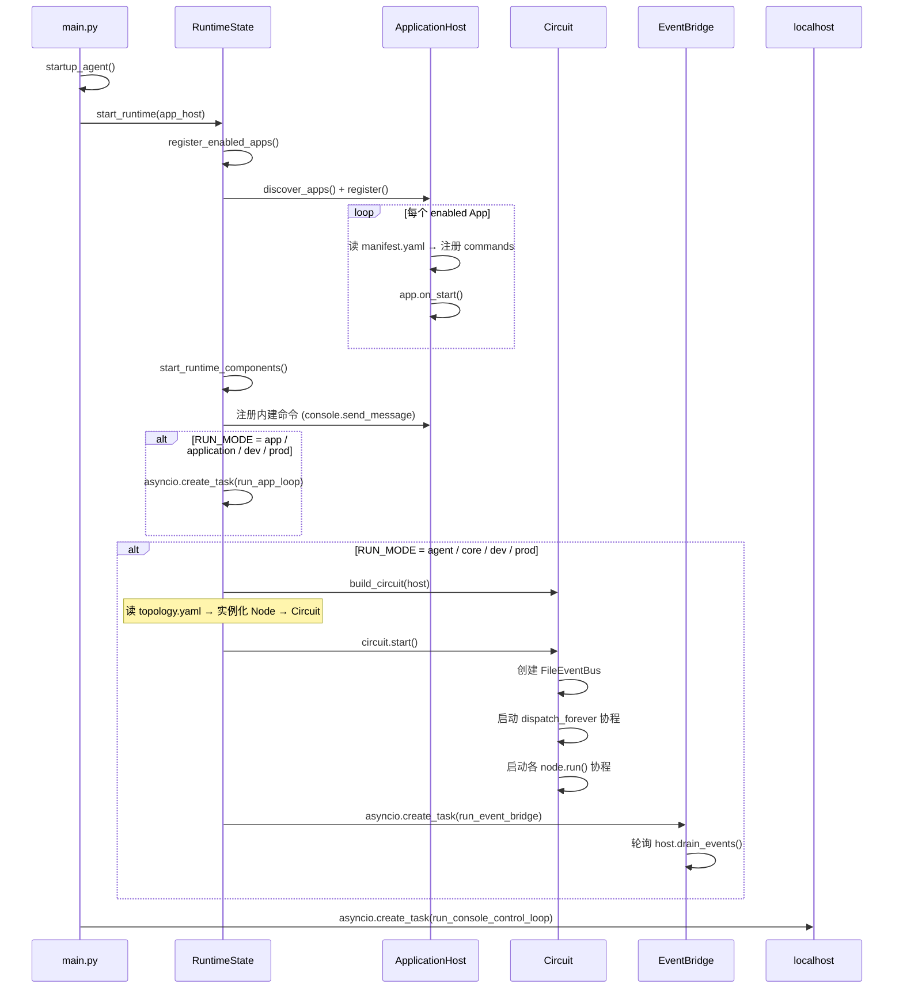
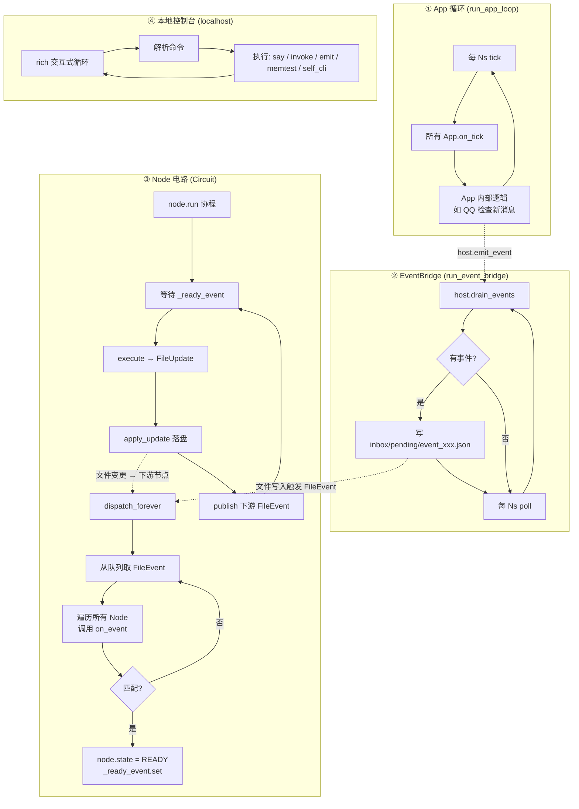
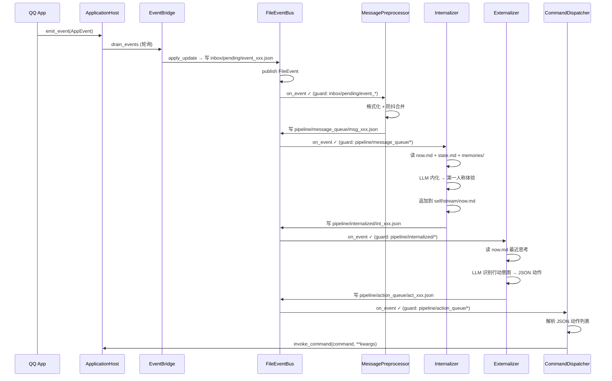
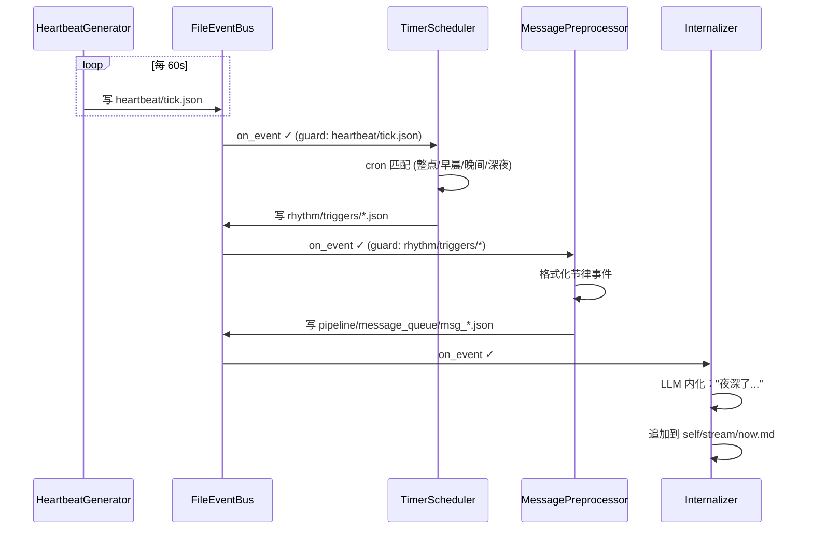

# 内核运行时流程图

## 启动流程

```mermaid
sequenceDiagram
    participant main as main.py
    participant runtime as RuntimeState
    participant host as ApplicationHost
    participant circuit as Circuit
    participant bridge as EventBridge
    participant console as localhost

    main->>main: startup_agent()
    main->>runtime: start_runtime(app_host)
    runtime->>runtime: register_enabled_apps()
    runtime->>host: discover_apps() + register()

    loop 每个 enabled App
        host->>host: 读 manifest.yaml → 注册 commands
        host->>host: app.on_start()
    end

    runtime->>runtime: start_runtime_components()
    runtime->>host: 注册内建命令 (console.send_message)

    alt RUN_MODE = app / application / dev / prod
        runtime->>runtime: asyncio.create_task(run_app_loop)
    end

    alt RUN_MODE = agent / core / dev / prod
        runtime->>circuit: build_circuit(host)
        Note over runtime: 读 topology.yaml → 实例化 Node → Circuit
        runtime->>circuit: circuit.start()
        circuit->>circuit: 创建 FileEventBus
        circuit->>circuit: 启动 dispatch_forever 协程
        circuit->>circuit: 启动各 node.run() 协程
        runtime->>bridge: asyncio.create_task(run_event_bridge)
        bridge->>bridge: 轮询 host.drain_events()
    end

    main->>console: asyncio.create_task(run_console_control_loop)
```

## 运行流程

```mermaid
graph TB
    subgraph A["① App 循环 (run_app_loop)"]
        A1[每 Ns tick] --> A2[所有 App.on_tick]
        A2 --> A3[App 内部逻辑<br>如 QQ 检查新消息]
        A3 --> A1
    end

    subgraph B["② EventBridge (run_event_bridge)"]
        B1[每 Ns poll] --> B2[host.drain_events]
        B2 --> B3{有事件?}
        B3 -->|是| B4[写 inbox/pending/event_xxx.json]
        B4 --> B1
        B3 -->|否| B1
    end

    subgraph C["③ Node 电路 (Circuit)"]
        C1[dispatch_forever] --> C2[从队列取 FileEvent]
        C2 --> C3[遍历所有 Node<br>调用 on_event]
        C3 --> C4{匹配?}
        C4 -->|是| C5[node.state = READY<br>_ready_event.set]
        C4 -->|否| C2

        C6[node.run 协程] --> C7[等待 _ready_event]
        C7 --> C8[execute → FileUpdate]
        C8 --> C9[apply_update 落盘]
        C9 --> C10[publish 下游 FileEvent]
        C10 --> C7
    end

    subgraph D["④ 本地控制台 (localhost)"]
        D1[rich 交互式循环] --> D2[解析命令]
        D2 --> D3[执行: say / invoke / emit / memtest / self_cli]
        D3 --> D1
    end

    A3 -.->|host.emit_event| B2
    B4 -.->|文件写入触发 FileEvent| C1
    C9 -.->|文件变更 → 下游节点| C1
```

## 事件处理流程 (Kernel-γ)

```mermaid
sequenceDiagram
    participant QQ as QQ App
    participant host as ApplicationHost
    participant bridge as EventBridge
    participant bus as FileEventBus
    participant preproc as MessagePreprocessor
    participant intern as Internalizer
    participant extern as Externalizer
    participant dispatch as CommandDispatcher

    QQ->>host: emit_event(AppEvent)
    host->>bridge: drain_events (轮询)
    bridge->>bus: apply_update → 写 inbox/pending/event_xxx.json
    bus->>bus: publish FileEvent

    bus->>preproc: on_event ✓ (guard: inbox/pending/event_*)
    preproc->>preproc: 格式化 + 防抖合并
    preproc->>bus: 写 pipeline/message_queue/msg_xxx.json

    bus->>intern: on_event ✓ (guard: pipeline/message_queue/*)
    intern->>intern: 读 now.md + state.md + memories/
    intern->>intern: LLM 内化 → 第一人称体验
    intern->>intern: 追加到 self/stream/now.md
    intern->>bus: 写 pipeline/internalized/int_xxx.json

    bus->>extern: on_event ✓ (guard: pipeline/internalized/*)
    extern->>extern: 读 now.md 最近思考
    extern->>extern: LLM 识别行动意图 → JSON 动作
    extern->>bus: 写 pipeline/action_queue/act_xxx.json

    bus->>dispatch: on_event ✓ (guard: pipeline/action_queue/*)
    dispatch->>dispatch: 解析 JSON 动作列表
    dispatch->>host: invoke_command(command, **kwargs)
```

### 节律环路

```mermaid
sequenceDiagram
    participant hb as HeartbeatGenerator
    participant bus as FileEventBus
    participant timer as TimerScheduler
    participant preproc as MessagePreprocessor
    participant intern as Internalizer

    loop 每 60s
        hb->>bus: 写 heartbeat/tick.json
    end

    bus->>timer: on_event ✓ (guard: heartbeat/tick.json)
    timer->>timer: cron 匹配 (整点/早晨/晚间/深夜)
    timer->>bus: 写 rhythm/triggers/*.json

    bus->>preproc: on_event ✓ (guard: rhythm/triggers/*)
    preproc->>preproc: 格式化节律事件
    preproc->>bus: 写 pipeline/message_queue/msg_*.json

    bus->>intern: on_event ✓
    intern->>intern: LLM 内化："夜深了..."
    intern->>intern: 追加到 self/stream/now.md
```
