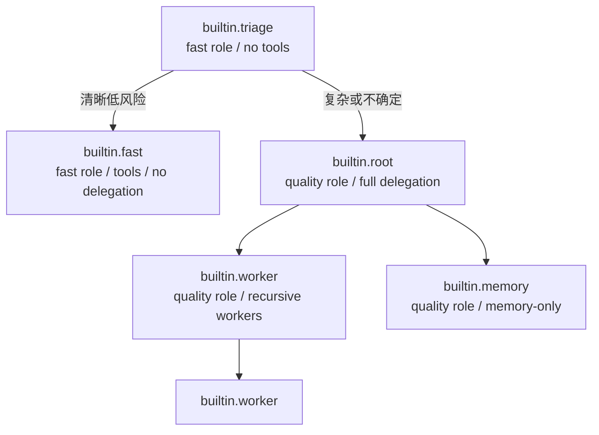

# 同构 Agent

AuroraBot 不再使用旧 Brain/Node 两套抽象。Triage、Fast、Root、Worker 与 Memory 都是同一种 Agent 实例，只因 profile、上下文和 handler 不同而承担不同职责。

## 三元组

```text
Agent instance = AgentContext + AgentProfile + BaseAgent handler
```

### AgentContext

每个 turn 的不可变视图，包含：

- 当前 Task 与 Agent；
- 本轮唯一消息；
- children 与待处理 child report；
- 固定的 MemoryContextSnapshot；
- 当前 profile；
- 已按授权过滤的工具定义。

handler 不持有 Engine、Provider、数据库或 Platform client。

### AgentProfile

```toml
[[agent]]
id = "builtin.root"
implementation = "src.agents.handler:ToolAgent"
model_role = "quality"
capabilities = ["*", "!aur.serv.memory.remember"]
can_delegate = true
child_profiles = ["builtin.worker", "builtin.memory"]
```

Profile 决定“她以什么角色思考、能看到哪些能力、可以把工作交给谁”，但不会创建新的运行时类型。

### Handler

`BaseAgent.handle(context) -> AgentDecision` 是纯决策边界。nightly 内建：

- `TriageAgent`：结构化注意力初筛；
- `ToolAgent`：通用模型、工具、委派、等待和完成链。

## 内建角色



| Profile | 模型 | 工具 | 委派 |
| --- | --- | --- | --- |
| Triage | Fast | 无 | 只可选择 Fast 或 Root |
| Fast | Fast | 除主动记忆外的已授权工具 | 不可 |
| Root | Quality | 除主动记忆外的已授权工具 | Worker、Memory |
| Worker | Quality | 除主动记忆外的已授权工具 | Worker |
| Memory | Quality | 仅 `aur.serv.memory.remember` | 不可 |

Triage 是 Task 的入口 root Agent；它 process 后创建的 Fast 或 Root 是普通 child。child 终止后，Triage 汇总结算整个 Task。

## AgentDecision

每次决策只允许一个互斥主迁移：

- 请求模型；
- 请求工具；
- 创建一个或多个 child Agent；
- 完成；
- 等待 children；
- defer；
- discard；
- 失败。

决策还可携带 `state_patch`、稳定事实候选和摘要，但不能同时选择两个主迁移。Engine 会在同一事务里更新状态、消息、Activity、因果事件和预算计数。

## 委派

模型通过 `aur.agent.delegate` 一次委派 1–4 个彼此独立的任务。Engine 再校验：

- 当前 profile 的 `can_delegate`；
- 目标是否属于 `child_profiles`；
- 单 Task Agent 总数；
- 委派深度；
- 单 Agent children 数；
- 全局活跃 Agent 数。

没有显式 profile 时使用 Engine 的通用 worker profile。子 Agent 只收到 assignment、相关记忆和自己的结果，不继承 Root 的完整历史。

存在未终止 children 时，`aur.agent.wait` 让 Agent 安静等待。等待由监督树和 Activity 派生，不写入易漂移的持久化 waiting 状态。

## 能力授权

能力 ID 有三个稳定域：

| 域 | 示例 | 含义 |
| --- | --- | --- |
| `aur.mcp.*` | `aur.mcp.org.aurora.clock.set_timer` | MCP 外部能力 |
| `aur.serv.*` | `aur.serv.memory.remember` | 进程内服务效果 |
| `aur.agent.*` | `aur.agent.delegate` | Agent 主动认知能力 |

Profile 规则支持：

- 精确 ID；
- 前缀通配 `package.*`；
- 全通配 `*`；
- `!` 排除；排除始终优先。

外部 schema 原样成为模型 tool schema。运行时不向任意 MCP schema 注入隐藏参数。只有能力明确声明 `runtime_completion` 时，才允许工具直接完成 Task。

## ToolAgent 的多调用链

模型响应可以同时包含控制能力和环境工具，也可以包含多个 Tool call。ToolAgent 会：

1. 保存完整调用链与 continuation；
2. 逐项产生获权 ToolRequest；
3. 为每项等待真实 AMP 回执；
4. 链尾把全部结果交还同一个 continuation；
5. 再由模型决定回复、继续调用、委派或完成。

Engine 不会只执行第一个调用，也不会伪造 Tool result。

## Prompt 与授权分离

SOUL、WORLD 和 profile Prompt 决定人格、表达和角色说明。它们不是安全策略。即使 Prompt 要求执行某能力，Engine 仍会校验目录、profile 授权、JSON Schema、Task 预算和 generation 提交资格。

## Agent 扩展现状

可以在源码可导入路径中实现 `BaseAgent` 子类，并通过 `implementation = "module:Class"` 配置。组合根会注入 PromptComposer 与 manifest 声明的 `ControlAction` 贡献。

::: warning 文档正在编写中
第三方 Agent 的独立打包、安装、自动发现、版本兼容、热加载、签名与分发规范尚未定义。当前支持的是显式源码导入与 TOML profile，不是稳定插件 ABI。详见[Agent 扩展](../develop/agent-development.md)。
:::

## 扩展贡献模型

目标契约中，扩展由 `Manifest + Lifecycle + 若干贡献` 组成。七类贡献为 `InputGateway`、`EventSource`、
`ControlAction`、`ContextContributor`、`EffectTool`、`OutputSink`、`Projector`。现行 `CapabilityAssembly` 已统一内建
control/memory 的四类贡献；其他贡献与平台生命周期仍由组合根既有路径装配，统一 Lifecycle 和七面快照尚在收口。
0.x 阶段进程内贡献只允许官方内建扩展，第三方仍以 MCP/AMP 外部形态参与。完整目标契约见唯一 RFC 的工具与能力章节。

## Sandbox

Sandbox 包不参与当前 Agent 运行时；其威胁模型、授权、资源限制、效果回执与产物回收文档正在编写中。不要把代码占位理解为可用能力。
