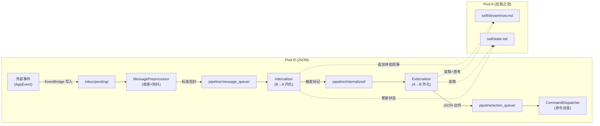

# 认知引擎架构

AuroraBot 的认知引擎（内部代号 CortexForge）当前运行 **Kernel-γ** 内核。核心理念：**她不是在处理消息，而是在体验生命。**

## 双池架构 (Pool A / Pool B)

Kernel-γ 将认知分为两个**物理隔离**的上下文池：

| 池                      | 格式            | 语态             | 职责                       |
| ----------------------- | --------------- | ---------------- | -------------------------- |
| **Pool A —— 自我之流**  | Markdown 纯文本 | 第一人称 "我..." | 维护完整的自我认知叙事     |
| **Pool B —— 神经JSON系统** | JSON 结构化 | 无主语           | 无状态处理、路由、派发     |

两个池子之间，由**两个转义者**桥接：

```
Pool B (JSON)  ──→  Internalizer (内化者)  ──→  Pool A (Markdown)
Pool A (Markdown) ──→  Externalizer (外化者) ──→  Pool B (JSON)
```

## 子系统概览

| 子系统                | 文档                           | 职责                                                    |
| --------------------- | ------------------------------ | ------------------------------------------------------- |
| **kernel** (节点系统) | [节点系统](./node-system.md)   | Node / Agent / Router / FileEventBus / Circuit          |
| **memory** (记忆系统) | [记忆系统](./memory-system.md) | L1/L2/L3 三级记忆 + SelfStream 自我之流                 |
| **ai** (模型网关)     | (本文档)                       | ModelGateway 多角色统一网关 (fast/quality/multimodal)   |
| **localhost** (控制台)| (本文档)                       | 命令行交互式调试                                        |

## Pool A: 自我之流 (The Self-Stream)

自我之流是她的"意识"。以第一人称 Markdown 纯文本维护，通过 `SelfStream` 类 (`src/brain/nodes/self_stream.py`) 管理。

### 设计原则

- **纯 Markdown，无 JSON**。自我认知不应被结构化数据污染。
- **第一人称**。每个字都以"我"为主语。
- **顺序追加**。新体验追加到流末尾，不修改历史。
- **自洽**。任何时候读这条流，都能看到一个完整、连贯的自我叙事。

### 文件结构

```
data/kernel/self/
├── stream/
│   ├── now.md                  # 当前意识流（最近体验和思考）
│   └── archive/
│       └── 2025-03-15.md       # 每日归档
├── state.md                    # 当前自我状态（情绪、精力、正在做的事）
├── memories/
│   ├── about_alice.md          # 持久记忆（按主题组织）
│   └── ...
└── diary/
    └── 2025-03-15.md           # 正式日记（她决定写的）
```

### 读写规则

| 操作           | 谁来做               | 触发条件                           |
| -------------- | -------------------- | ---------------------------------- |
| 追加体验       | Internalizer         | Pool B 事件被内化时                |
| 追加思考       | 她自己 (Externalizer 上下文) | 读完 now.md 后有话想说      |
| 更新 state.md  | Internalizer         | 情绪或状态发生变化                 |
| 提取记忆       | MemoryConsolidator   | 定期扫描 now.md（未启用）          |
| 归档 now.md    | 定时任务 (未启用)    | 每日或 now.md 超过阈值时           |

## Pool B: 神经JSON系统 (The Nervous System)

Pool B 不做任何"理解"——它只做机械性的路由、转换、派发。零 LLM 调用。

### 文件结构

```
data/kernel/
├── inbox/pending/               # 所有外部事件
├── pipeline/
│   ├── message_queue/           # 预处理后的体验单元
│   ├── internalized/            # Internalizer 完成标记
│   └── action_queue/            # 待执行的动作
├── heartbeat/
│   └── tick.json                # 心跳脉冲
├── rhythm/triggers/             # 节律触发器
└── dead_letter/                 # 超期未消费的文件（未启用）
```

### 标准信封

流经 Pool B 的每个 JSON 文件包裹在统一信封中：

```json
{
  "envelope": {
    "id": "msg_a1b2c3d4",
    "trace_id": "trace_x1y2z3",
    "timestamp": "2025-03-15T10:30:00Z",
    "source_node": "message_preprocessor",
    "session_key": "private:user123"
  },
  "payload": { "..." : "节点特定数据" }
}
```

## 两转义者：认知的核心

### Internalizer（内化者）—— B → A

**Agent 节点**，LLM 驱动。将 Pool B 中的结构化事件转化为 Pool A 中的第一人称体验叙事。

- **输入**: `pipeline/message_queue/msg_*.json` + now.md + state.md + memories/
- **输出**: 追加到 `self/stream/now.md`（第一人称体验叙事）
- **提示词**: `INTERNALIZER.md`

> 她不是在"格式化事件为文本"——是在用她的视角、她的记忆、她当前的状态去**理解这个事件对她的意义**。

### Externalizer（外化者）—— A → B

**Agent 节点**，LLM 驱动。从 Pool A 的自我之流中识别她的意图和决定，转化为 Pool B 的结构化动作。

- **输入**: now.md + state.md（由 `pipeline/internalized/*.json` 触发）
- **输出**: `pipeline/action_queue/act_*.json`（结构化动作）
- **提示词**: `EXTERNALIZER.md`

> Externalizer 不做回复决策——决策已在自我之流中做出。Externalizer 只是把**她已经做出的决定**翻译成机器可执行的形式。

## 当前启用的认知管线



## 节律环路

节律不是外挂的定时任务——**时间是她的另一种感官**。

```
HeartbeatGenerator (60s心跳) → TimerScheduler (cron匹配)
  → MessagePreprocessor → Internalizer
  → "夜深了...我想回顾今天发生了什么"
```

TimerScheduler 产出 `rhythm/triggers/` 下的节律文件（hourly、morning、evening、midnight），通过**和消息事件完全相同的路径**进入 Pool A。

## 已实现但未启用的节点

```yaml
- id: memory_consolidator  # MemoryConsolidator — 记忆沉淀与归档
- id: metrics_collector    # MetricsCollector — 文件流转统计
- id: dead_letter          # DeadLetterRouter — 超期文件回收
# 旧 Kernel-β 节点（全部 disabled）:
- id: impulse_gate         # ImpulseGate
- id: action_planner       # ActionPlanner
- id: polaris              # PolarisAgent (旧单体)
```

## 下一步阅读

- 想了解节点数据结构与类型: 读 [节点系统](./node-system.html)
- 想了解记忆存储与检索: 读 [记忆系统](./memory-system.html)
- 想了解 Circuit 与 EventBridge 的协作细节: 读 [内核运行时](./kernel-runtime.html)
- 想了解 Kernel-γ 的完整设计: 读 [Kernel-γ 路线图](../appendix/kernel-gamma-roadmap.html)
- 想自己写节点: 读 [认知节点开发](../develop/brain-node-development.html)
