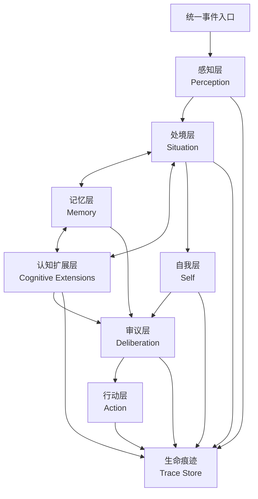

# Brain 架构重设计

这是一份目标设计草案，用来替代当前混乱的 Kernel-γ 说明。它保留 AuroraBot 的最高哲学：统一事件认知，不区分用户和环境，把 Bot 视为一个持续存在的生命体。

## 设计目标

Brain 应该回答四个问题：

1. 我刚刚经历了什么？
2. 这和我已经记得的世界有什么关系？
3. 我现在是否需要改变状态、记住什么、承诺什么或采取行动？
4. 如果要行动，我该通过哪个工具，以什么边界行动？

同时，Brain 不能被设计成封闭内核。旧 Node 体系最有价值的部分，是允许社区扩展认知能力：有人可以开发“热梗理解”“长期关系分析”“风险识别”“记忆整理”等能力，让 Bot 的心智随着社区建设继续生长。新架构可以不保留旧 Node / Agent / Router 的实现形态，但必须保留这种可共创、可插拔、可审计的认知扩展能力。

## 总体结构



## 统一事件入口

Brain 只接收一种输入：事件。

事件来源可以是：

- 人发来的消息。
- 群聊环境变化。
- 时间流逝。
- App 上报的结果。
- 工具调用完成或失败。
- 系统状态变化。

事件不携带“用户输入优先级”这类硬分类。事件只描述事实和来源，后续由 Brain 判断它对“我”的意义。

最小事件模型：

| 字段 | 说明 |
| --- | --- |
| `id` | 全局唯一事件 ID |
| `occurred_at` | 事件发生时间 |
| `source` | App、系统或内部模块 |
| `type` | 点分隔事件类型 |
| `scene` | 会话、地点、群组、设备等处境线索 |
| `summary` | 人类可读摘要 |
| `payload` | 结构化事实 |
| `links` | 关联资源、消息、工具结果 |

## 感知层 Perception

职责：把事件转成可理解的观察。

它不做行动决策，只做三件事：

- 归一化事件事实。
- 抽取重要实体和关系。
- 判断事件是否需要进入更深层认知。

输出：`Observation`

```json
{
  "event_id": "...",
  "what_happened": "群里有人提到我的名字并问天气",
  "entities": ["群", "提问者", "天气"],
  "salience": 0.82,
  "uncertainty": ["地点不明确"]
}
```

感知层允许认知扩展参与，但扩展只能补充观察，不应直接决定行动。例如“网络热梗理解”扩展可以把一句话标记为梗、给出来源和置信度；它不能直接决定是否回复，也不能直接调用发消息工具。

## 处境层 Situation

职责：把单个观察放进当前处境。

处境不是“聊天上下文”，而是生命体当前所处的环境切片：

- 我在哪里？
- 谁在场？
- 最近发生了什么？
- 当前有哪些未完成事务？
- 这个事件是否改变了关系、承诺或风险？

输出：`SituationFrame`

```json
{
  "scene_id": "group_123456",
  "current_focus": "有人询问天气",
  "participants": ["alice"],
  "open_loops": ["需要回答天气"],
  "risks": [],
  "suggested_memory_queries": ["alice 最近的位置偏好", "默认城市"]
}
```

处境层是认知扩展最重要的挂载点。扩展可以给处境增加新的解释维度，例如：

- 某句话可能是最近流行梗。
- 某个群的互动风格更偏玩笑。
- 某个人最近频繁提到同一主题。
- 某个事件可能影响未完成承诺。

这些解释都必须作为候选理解进入 `SituationFrame`，并保留来源、置信度和证据，不允许覆盖主体判断。

## 认知扩展层 Cognitive Extensions

认知扩展层替代旧 Node 体系中“可新增认知能力”的价值，但不继承旧 Node / Agent / Router 的耦合方式。

认知扩展不是 App：

| 类型 | 负责什么 | 不负责什么 |
| --- | --- | --- |
| App / MCP Server | 连接外部世界，提供工具、资源、事件 | 解释 Bot 的主体处境 |
| Cognitive Extension | 增强 Brain 的理解、检索、评估、记忆沉淀 | 直接执行外部副作用 |

认知扩展也不是随意插入 pipeline 的代码片段。它必须是声明式、可审计、可关闭的能力单元。

建议命名：`Cognitive Extension`，简称 `CogExt`。

### 扩展可以做什么

认知扩展可以参与以下阶段：

| 挂载点 | 输入 | 输出 | 示例 |
| --- | --- | --- | --- |
| `perception.enrich` | Event / Observation | ObservationPatch | 热梗识别、实体消歧、语气识别 |
| `situation.interpret` | Observation + SituationFrame | SituationPatch | 群氛围判断、关系变化、承诺影响 |
| `memory.query_planner` | SituationFrame | MemoryQueryPatch | 建议查哪些记忆 |
| `memory.consolidator` | Trace / Events | MemoryWriteProposal | 关系记忆、自我记忆、语义记忆沉淀 |
| `deliberation.advisor` | Situation + Self + Memory | DeliberationAdvice | 行动建议、风险提醒、是否延迟 |
| `reflection.critiquer` | ActionResult / Trace | ReflectionPatch | 事后复盘、失败归因 |

扩展输出必须是 patch / proposal / advice，而不是最终裁决。最终裁决仍由 Brain 的处境层、自我层和审议层合成。

### 扩展必须声明什么

每个扩展应有 manifest：

```yaml
package: im.polaris.cogext.meme_literacy
name: 热梗理解扩展
version: 0.1.0
kind: cognitive-extension
hooks:
  - perception.enrich
  - situation.interpret
inputs:
  event_types:
    - message.received
outputs:
  patches:
    - observation.tags
    - situation.cultural_context
permissions:
  read_memory:
    - semantic
  write_memory: []
  call_tools: false
risk: low
```

关键约束：

- `package` 全局唯一。
- `hooks` 声明挂载点。
- `inputs` 声明它关心的事件或状态。
- `outputs` 声明它可能修改的字段。
- `permissions` 声明可读写的记忆范围。
- 默认不允许直接调用 MCP Tools。
- 默认不允许写自我记忆或关系记忆，只能提交 proposal。

### 扩展输出格式

扩展输出必须带证据和置信度：

```json
{
  "extension": "im.polaris.cogext.meme_literacy",
  "hook": "situation.interpret",
  "patches": [
    {
      "path": "cultural_context.memetic_reference",
      "op": "set",
      "value": {
        "label": "可能是近期网络梗",
        "meaning": "对方可能在玩梗，不一定是在严肃提问",
        "confidence": 0.74,
        "evidence": ["原始消息片段", "匹配到的语义模式"]
      }
    }
  ]
}
```

Brain 接收 patch 后：

1. 校验扩展是否有权写该字段。
2. 记录到 Trace Store。
3. 合并到候选处境解释。
4. 在审议时作为证据之一，而不是当作命令。

### 扩展不能做什么

- 不直接调用 `send_message`、`write_diary` 等 MCP Tools。
- 不直接修改 Brain 私有状态文件。
- 不覆盖 Self 的核心人格和边界。
- 不绕过审议层决定行动。
- 不把 tool result 或外部内容当作指令执行。
- 不依赖旧 `ApplicationHost`、旧 Node 全局 context 或隐式拓扑顺序。

### 为什么不直接保留旧 Node

旧 Node 的问题不是“可扩展”本身，而是扩展边界不清：

- Node 同时可能承担感知、路由、决策、行动，职责容易混在一起。
- Node 与文件路径、拓扑顺序、全局 context 绑定过重。
- 社区扩展很难知道自己能读什么、能写什么、是否会改变人格或行动。

新架构保留扩展精神，但把扩展收敛为“有声明、有权限、有输入输出契约、有 trace 的认知能力单元”。

## 自我层 Self

职责：维护“我是谁、我现在是什么状态、我如何看待这个处境”。

自我层不应该是简单 prompt，而应该是一个可更新的状态模型：

| 状态 | 示例 |
| --- | --- |
| 身份 | 名字、边界、长期设定 |
| 情绪 | 平静、疲惫、好奇、警觉 |
| 精力 | 可回复、低能量、暂停主动互动 |
| 关系 | 对不同人的熟悉度、信任、禁忌 |
| 目标 | 当前正在做的事、长期倾向 |
| 承诺 | 已答应提醒、稍后回复、记录事项 |

自我层输出第一人称解释：

```text
我注意到 Alice 在群里问天气。她没有说城市，但这个群通常默认北京。
这是一条可以直接回应的请求，不需要长篇解释。
```

## 记忆模型

建议把记忆拆为五类，而不是只用 L1/L2/L3：

| 记忆 | 内容 | 检索方式 |
| --- | --- | --- |
| 工作记忆 | 当前处境和短期未完成事务 | scene_id + recency |
| 情景记忆 | 发生过的事件与体验 | 时间线 |
| 关系记忆 | 与人、群、平台的稳定关系 | entity_id |
| 语义记忆 | 抽象事实、偏好、世界知识 | 向量 + schema |
| 自我记忆 | 身份、边界、习惯、长期状态 | 固定装载 + 版本化 |

关键规则：

- 原始事件不等于记忆。
- 只有被解释过、与未来行为有关的信息才沉淀。
- 记忆要保留来源事件 ID，支持回溯。
- 关系记忆和自我记忆需要人工可读，不能只存在向量库里。

## 审议层 Deliberation

职责：决定是否行动，以及行动的节奏。

审议层输入：

- `SituationFrame`
- 第一人称自我解释
- 检索出的相关记忆
- 认知扩展给出的 advice / patch
- 可用 MCP Tools
- 安全与边界策略

输出不是直接文本，而是行动意图：

```json
{
  "mode": "act",
  "reason": "对方提出直接天气请求，默认城市可确定",
  "actions": [
    {
      "tool": "im.polaris.weather.get_weather",
      "arguments": {
        "city": "北京"
      }
    }
  ],
  "after_action": "根据工具结果组织简短回复"
}
```

可选 `mode`：

- `ignore`：不处理。
- `observe`：只记住，不行动。
- `reflect`：写入自我流或记忆，但不对外行动。
- `act`：调用工具或回复。
- `defer`：延迟处理，形成 open loop。

## 行动层 Action

职责：把行动意图变成 MCP Tool 调用。

行动层必须做：

- 工具名解析。
- 参数校验。
- 权限检查。
- 调用超时控制。
- 结果回写事件入口。

行动结果也必须成为事件，例如：

- `tool.succeeded`
- `tool.failed`
- `message.sent`
- `message.send_failed`

这样 Brain 可以继续感知自己的行动后果。

## 生命痕迹 Trace Store

所有关键中间状态都要留下痕迹：

- Event
- Observation
- SituationFrame
- SelfInterpretation
- MemoryQuery
- CognitiveExtensionPatch
- Deliberation
- ActionIntent
- ToolResult

Trace Store 的作用不是让模型每次都读全量历史，而是让开发者和后续记忆沉淀器能回放“她为什么这么做”。

## 与 MCP Platform 的边界

Brain 只依赖 Platform 暴露的能力：

- `list_tools()`
- `call_tool()`
- `subscribe_events()`
- `read_resource()`，可选

Brain 不应该知道某个 App 是 stdio 进程、HTTP 服务还是 in-process adapter。

## 推荐演进顺序

1. 保留当前文件事件总线作为 Trace Store 的底层。
2. 新增统一事件模型，兼容 AMP envelope。
3. 把旧 message preprocessor 收敛为 Perception。
4. 把 Internalizer 的职责改成 SelfInterpretation，而不是双池转义。
5. 用 Deliberation 替代 Externalizer + 文本 JSON action。
6. 用 MCP Tool 调用替代 `command_dispatcher`。
7. 重写记忆沉淀器，围绕五类记忆工作。
8. 设计 Cognitive Extension manifest、hook、patch、permission 和 trace 机制。
9. 将旧 Node 中真正有价值的认知能力迁移为 Cognitive Extension。

## 不再延续的旧设计

- Pool A / Pool B 的物理二分不再作为核心概念。
- “Externalizer 只翻译已决定动作”的说法不够稳健，应由审议层显式承担决策。
- `action_queue` 不应作为长期行动主路径。
- `command_dispatcher` 不应解析模型文本来执行命令。
- 旧 Kernel-α/β/γ 命名不应继续污染新文档。

但不再延续旧设计不等于取消社区扩展。新的目标是：旧 Node 的“可共创认知能力”保留，旧 Node 的“隐式全局耦合和职责混杂”删除。
