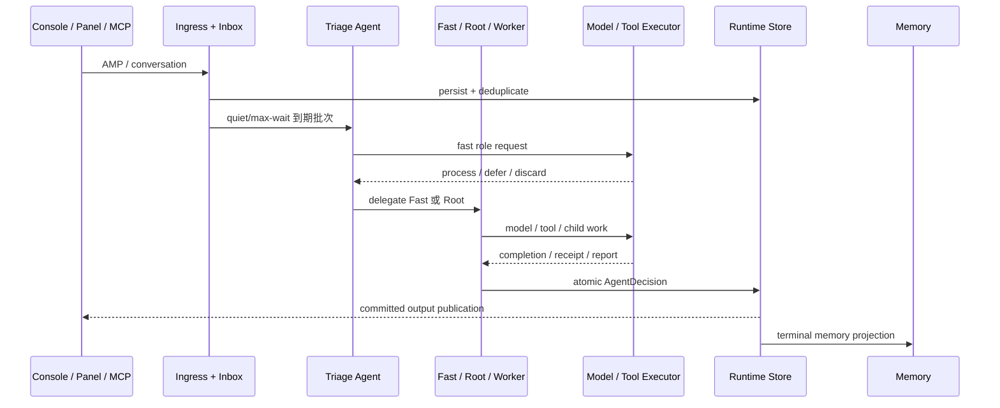
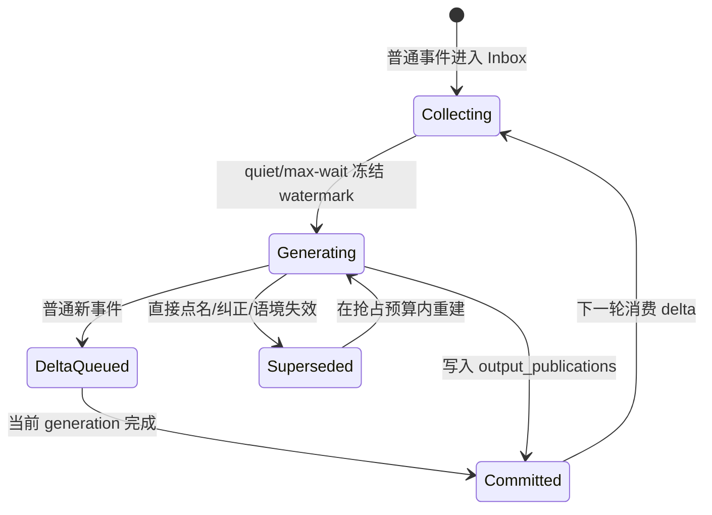

# 事件与运行时

Engine 拥有从外部事实到最终输出的完整因果热路径。本页描述一条交互事件如何进入、聚合、决策、执行并提交。

## AMP 入口

外部事实通过 `submit_amp`，Console/Panel 文本通过 `submit_conversation` 进入 Engine。后者也会归一化为 AMP 语义。

```text
AMP
├─ header
│  ├─ protocol = "amp/1.0"
│  ├─ method = "aurora/event"
│  ├─ message_id
│  ├─ timestamp
│  └─ source { app, instance }
└─ payload
   ├─ type
   ├─ session_id
   ├─ summary
   ├─ data
   └─ expire_at
```

生产者必须提供稳定 `message_id` 或可推导的幂等键。重复输入不能创建重复工作。工具回执使用保留的 `tool.*` 类型，只能匹配已持久化 Activity，不进入普通 Inbox。

## 一条消息的生命周期



## Inbox 与防抖

Inbox 按 `session_id` 分区：

- 新事件刷新 quiet window；
- 本轮等待不能超过首条事件的 max wait；
- 批次受事件数和字符数双重限制；
- 到期批次创建一个 Task 和入口 Triage Agent；
- 超大事件在进入模型上下文前只保留有界投影。

默认 quiet 与 max wait 都是 3 秒，单批最多 24 个事件、12000 字符。

## Triage

Triage 没有工具，只能作出三个控制决策：

- `process`：选择 Fast 或 Root，并通过普通委派传递有界事实；
- `defer`：延后到下一时间点，受累计上界限制；
- `discard`：删除原始 Inbox 数据。

路径选择：

| 目标 | 适用情况 |
| --- | --- |
| `builtin.fast` | 清晰、低风险、短链路，可直接响应或调用工具 |
| `builtin.root` | 复杂、歧义、高影响、需要规划或可能继续委派 |

结构化结果缺失、目标非法或模型失败时 fail-open 到 Root，避免静默丢失输入或把不确定工作压入快路径。

## Agent turn

每个 turn 只领取一条持久化消息：

1. 读取 Task、Agent、children、记忆快照和获权能力；
2. 构造不可变 `AgentContext`；
3. 调用 handler；
4. 校验能力、委派、Triage 控制权和预算；
5. 在单事务内应用一个 `AgentDecision`；
6. 唤醒新产生的 Model 或 Tool Activity。

等待不是单独持久化状态，而是从活跃 Activity、未终止 children 和待处理报告派生。

## Activity

模型和工具请求先落库，再异步派发。并发槽释放后立即按优先级领取下一项，不等待同一批其他工作全部完成。

| Activity | 执行者 | 返回 |
| --- | --- | --- |
| Model | 注入的 ModelProvider | `model.completed` / `model.failed` |
| Tool | 扁平 ToolExecutor 目录 | `tool.succeeded` / `tool.failed` / `tool.unknown` |

同一个模型响应中的多个 Tool call 会全部保存为可恢复链。每项都必须得到真实结果，链尾才恢复模型 continuation。

## 会话 lane 与 revision

持续输入不会让每条 AMP 都重启生成。`session_lanes` 持久化：

- `observed_revision`：已观察输入版本；
- `generation_revision`：本轮冻结的版本；
- `committed_revision`：已发布版本；
- `generation_watermark`：本轮输入截止点；
- `active_task_id`：会话唯一活动交互 Task；
- 抢占计数与时间边界。



普通群聊消息只进入 delta，当前回复可以先提交。只有直接点名、明确纠正或使当前回复失效的高优先级事实才能请求抢占。

## 提交屏障

旧 generation 被 supersede 后可以保留审计记录，但不能：

- 创建新的用户消息；
- 继续创建工具效果；
- 恢复 Agent；
- 写入用户可见输出。

模型结果、工具回执和输出发布都会重新校验 Task、session lane 与 generation revision。平台只读取单调追加的 `output_publications`，因此不支持撤回的平台也不会看到旧结果。

已经进入 PROCESSING 的不可撤回工具会阻止抢占，先完成效果，再在下一轮消费 delta。

## Task 与 Agent 终态

Task 终态：

- `COMPLETED`
- `SILENT`
- `CANCELLED`
- `BUDGET_EXHAUSTED`
- `ERROR`

Agent 基态：

- `READY`
- `COMPLETED`
- `FAILED`
- `CANCELLED`

所有终态行保留在 Runtime SQLite，供因果查询与恢复使用。

## 崩溃恢复

启动时：

- PROCESSING 消息回到 PENDING；
- 中断模型 Activity 转为 ERROR，并向 Agent 投递失败消息；
- 工具 Activity 保留并由 ToolRegistry 恢复；
- 工具回执按 request ID 幂等消费；
- superseded generation 的晚到结果仍被提交屏障拒绝。

当前尚未提供面向用户的 TTL、checkpoint 和清理操作，见 [Nightly 实现状态](../reference/nightly-status.md)。
