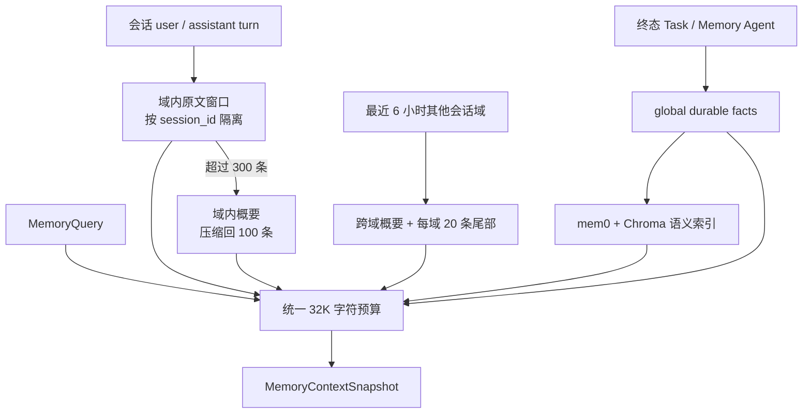

# 记忆系统

MemoryService 同时承载被动终态投影和主动 Memory Agent 写入。Engine 只依赖异步 `MemoryStore` Port，handler 每轮只看到已经固定的有界快照。

## 三层记忆



### 域内窗口

最近的 user/assistant 原文按 `session_id` 隔离。默认上界 300 条，超过后一次压缩较旧内容，保留 100 条最新原文。

### 域内概要

旧窗口与已有概要由 Fast 角色重新浓缩，概要最长 2400 字符。模型不可用时使用确定性尾部裁剪降级，并记录警告。

### 全局长期事实

稳定事实统一写入 `scope="global"`，携带来源 Task ID 并做幂等去重。Memory Agent 使用 `aur.serv.memory.remember` 主动写入；交互 Task 终态也可以投影 Triage/Agent 提取的事实候选。

长期检索优先使用配置的 Embedding 与 mem0/Chroma，失败或无结果时回退到 durable facts 关键词排序。

## 跨域动态

AuroraBot 不把每个 IM 会话当成完全隔离的人格。一次 recall 除当前域外，还会读取：

- 最近 6 小时内更新的其他域概要；
- 每个活跃域最多 20 条最新窗口消息；
- 每项都带域标签，例如 `qq:group:123`；
- 不活跃域不会进入当前快照。

这让 Agent 能保持跨会话的连续时间体验，同时避免回放所有历史。

## 有界快照

`MemoryQuery` 默认：

```python
MemoryQuery(
    query="本轮检索文本",
    scope="panel:owner",
    fact_limit=4,
    max_characters=32000,
    remote_tail=20,
    remote_recency_seconds=21600.0,
)
```

预算消费顺序固定：

1. 当前域概要；
2. 当前域最新窗口；
3. 跨域概要；
4. 跨域尾部；
5. 相关长期事实。

当前域窗口不能独占全部剩余预算。跨域动态与长期事实至少保留 `min(剩余预算 / 3, 8000)` 字符保障。选择时从新到旧，最终窗口恢复为时间正序。

## 异步边界

MemoryStore 是 async Port：

- recall 通过受控工作线程执行 SQLite、mem0、Chroma 和同步 embedding；
- 窗口压缩直接 await Fast 模型角色；
- handler 不执行记忆 I/O；
- Engine pump 不被同步网络调用阻塞。

## 写入路径

### 被动投影

交互 Task 终止后，Engine 异步投影：

- 输入摘要；
- 结果摘要；
- 会话窗口 turn；
- 稳定事实候选。

工具失败或记忆降级不会回滚已经提交的用户输出。

### 主动记忆

`builtin.memory` 只获权 `aur.serv.memory.remember`。模型提交内容与 `fact_candidates` 后：

1. MemoryCapability 构造 ToolRequest；
2. MemoryToolExecutor 写入同一 MemoryService；
3. 结果以 `tool.succeeded` 或 `tool.failed` AMP 返回；
4. 原 Agent 从真实回执继续。

## 数据布局

```text
data/memory/
├─ memory.sqlite3
├─ mem0-history.sqlite3
└─ chroma/
```

`memory.sqlite3` 包含：

- session 窗口；
- session 概要；
- global durable facts；
- 幂等写入回执。

Memory schema 当前为 v2，使用与其他存储一致的连续迁移机制。

## 可观察性

Console：

```text
/memory/status
/memory/history --scope panel:owner --limit 32
/memory/search --query "关键词" --scope panel:owner --limit 8
```

REST：

```text
GET /api/ops/memory/status
GET /api/ops/memory/history?scope=panel:owner&limit=32
GET /api/ops/memory/search?query=关键词&scope=panel:owner&limit=8
```

`memory.status` 会公开语义层是否 enabled、是否 degraded 和原因。

## 当前边界

- 默认窗口上下界、32K 字符预算、跨域 6 小时与 20 条尾部目前是代码契约，没有单独 TOML 配置；
- 语义层依赖 `embedding` 与 `quality` 模型角色；不可用时仍保留关键词降级；
- 当前没有用户可执行的记忆 TTL、批量清理、备份或恢复操作；
- 长期 24/72 小时 soak 验证仍在规划。

这些运维接口的文档正在编写中。在公共操作落地前，不要直接修改运行中的 Memory SQLite。
