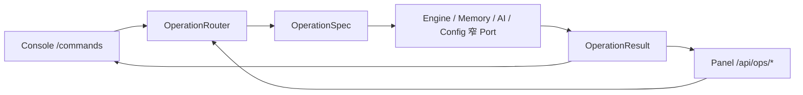

# Ops 与持久化

Ops 是热路径外的唯一操作后端。SQLite 是每个实现包的私有数据权威；Ops 通过窄 Port 查询或输入，不直接穿透到 Engine、Memory 或 AI 的实现对象。

## 同构操作树

`@operation` 声明一项操作的：

- HTTP method 与资源 path；
- 稳定 name 与可读 summary；
- Console alias；
- path/query/body 参数；
- handler 与 `OperationResult`。



Console 和 REST 不各写一套业务逻辑。

## 资源域

| 域 | 主要资源 |
| --- | --- |
| System | 操作目录自描述 |
| Engine | status、Task、Agent、因果事件、AMP 注入、pump、shutdown |
| Messages | 会话投影、输入与输出流 |
| Memory | history、search、status |
| AI | cost、models、roles |
| Config | Agent profiles、脱敏快照、Prompt |
| Console | 清屏与终端日志开关 |

完整实时目录由 `GET /api/ops` 或 `/help` 返回。

## Panel 安全边界

Panel 后端是单个 FastAPI 应用：

- 只能绑定 loopback；
- `/healthz` 是唯一公开业务信息的无认证端点；
- bootstrap token 从 `data/ops/Token.txt` 读取；
- 登录后签发随机 Bearer session，并设置同源 HttpOnly cookie；
- session 以摘要形式保存在 Ops SQLite，具有 TTL；
- WebSocket 同时校验 session 与 Origin 白名单；
- Lab、附件和其他业务端点都需要认证。

这是一套本地单 owner 检查边界，不是公网、多用户或权限分级系统。

## 对话与输出权威

Panel 不维护独立聊天数据库：

- 历史来自 `causal_events` 与 session export；
- 用户可见文本来自 `output_publications`；
- WebSocket 从连接时的输出尾游标开始，只推送增量；
- 旧历史由 `GET /messages` 查询；
- Console 与 Panel 消费同一输出源。

因此不会出现“终端看到一版、面板数据库保存另一版”的双写。

## 数据布局

```text
data/
├─ engine/
│  └─ runtime.sqlite3
├─ ai/
│  └─ cost.sqlite3
├─ memory/
│  ├─ memory.sqlite3
│  ├─ mem0-history.sqlite3
│  └─ chroma/
├─ ops/
│  ├─ panel.sqlite3
│  ├─ Token.txt
│  └─ uploads/
└─ platform/
   └─ mcp/
      └─ apps/
```

路径由 `storage.toml` 显式配置，并必须镜像包职责。Engine 的 `workspace` 必须与 `storage.engine` 一致。

## Runtime SQLite

`data/engine/runtime.sqlite3` 是唯一 Agent 运行态与终态，主要包含：

- Inbox 与批次；
- session lane、revision 与 watermark；
- Task、Agent 和邮箱消息；
- Model/Tool Activity；
- 因果事件；
- 工具幂等回执；
- 单调追加的用户输出提交流。

没有 JSON archive、JSONL conversation log 或文件投递箱。

## Schema 与迁移

| 存储 | 当前版本 |
| --- | --- |
| Engine runtime | v10 |
| Memory | v2 |
| AI cost | v1 |
| Ops panel | v1 |

统一规则：

- SQLite 使用 WAL 与 busy timeout；
- 版本存于 `schema_meta`；
- 全新库直接创建当前 schema；
- 旧库按 `vN_vN+1` 连续迁移；
- 缺失步骤、失败事务或数据库版本高于代码时拒绝启动；
- 业务代码只访问当前版本形状。

Engine v10 增加 session lane、generation revision 与 `output_publications`，v9 数据通过连续迁移升级。

## 因果事件

`causal_events` 是会话可读性、调试和导出的权威。它记录输入、状态迁移、模型/工具活动、Agent 关系与终止原因。Ops 可以按 session、Task、类型和 cursor 查询，也可以导出会话投影。

日志不是因果权威。日志用于诊断进程，不应记录完整 Prompt、真实对话或工具敏感载荷。

## 附件

Ops 把附件文件存入 `uploads/`，把名称、MIME、大小和随机存储名索引到 `panel.sqlite3`。对话事件只携带稳定引用。

附件索引不等于多模态理解；内容读取链路仍在编写。

## 保留、清理与备份

::: warning 文档正在编写中
nightly 尚未提供：

- 终态 Task 与因果事件 TTL；
- 费用聚合与有界历史清理；
- 显式 WAL checkpoint；
- Engine、Memory、AI、Ops 的一致备份/恢复操作；
- 清理后仍保持外部消息幂等的墓碑策略；
- 24/72 小时 soak 基线。

在这些操作落地前，不要在 AuroraBot 运行时直接删除行、替换数据库或清理 WAL 文件。需要迁移数据时，应先停止进程并保留完整数据目录副本，但当前版本不承诺跨提交的任意手工恢复兼容性。
:::
