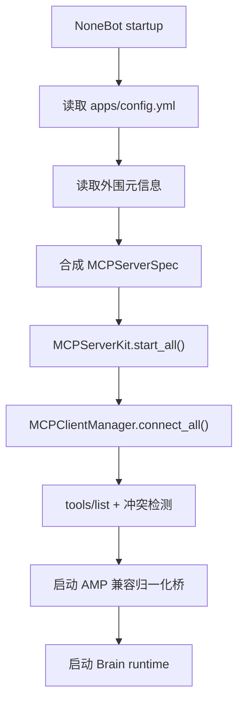
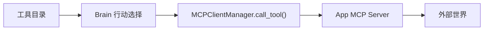

# 平台运行时

Platform 是 AuroraBot 的协议边界层。重构完成后，旧 `ApplicationHost`、`PlatformAPI`、进程内 `on_tick()` App 循环不再是主路径。

Platform 的关键意义是位置解耦：主仓库不需要规定 MCP Server 或 App 的代码位置。只要能通过 MCP 连接，并提供必要的外围元信息，App 可以在主仓库内、独立仓库、本机任意目录或远程服务中运行。

## 核心职责

| 组件 | 职责 |
| --- | --- |
| `MCPServerKit` | 根据连接配置启动、停止、重启本地 App MCP Server |
| `MCPClientManager` | 为每个 Server 建立 MCP session，维护工具目录并执行工具调用 |
| `AMP Compatibility Bridge` | 把标准 MCP 信号和可选 `aurora/event` 归一化为 Brain 统一事件 |
| `Tool Schema Adapter` | 把 MCP Tool schema 转成 LLM 可用的工具描述 |

Platform 只处理连接、协议、权限和生命周期，不处理认知决策。

## 启动顺序



启动阶段必须失败得足够早：

- App 配置声明启用本地 MCP，但启动命令不可用：启动失败。
- 两个 Server 暴露同名工具且无法加 package 前缀区分：启动失败。
- MCP 协议初始化失败：该 App 标记为不可用，并在健康状态中暴露原因。

## App 连接配置

`apps/config.yml` 是 Platform 的 App 编排入口，不是 App 目录规范。

```yaml
apps:
  aurora-app-weather:
    enabled: true
    startup:
      default_city: 北京
      language: zh
    mcp:
      enabled: true
      transport: stdio
      command: ["uv", "run", "python", "-m", "apps.aurora-app-weather.mcp_server"]
      env: {}
      health_timeout_seconds: 10.0
```

约定：

- `enabled` 控制 App 是否参与本次启动。
- `startup` 是业务启动参数，由 App 自己解释。
- `mcp.enabled` 控制是否走 MCP 主路径。
- 第一期默认 `stdio`；远程或多实例部署再启用 Streamable HTTP。

对于主仓库外的 App，`command` 可以指向任意本地路径；对于远程 App，可改用 Streamable HTTP endpoint。Platform 只关心连接成功后的 MCP capability 与工具目录。

## 工具调用通道

MCP Tool 是 AuroraBot 的唯一 App 动作通道。



工具命名规则：

- 对 Brain 暴露的工具名使用 package 前缀，例如 `im.polaris.weather.get_weather`。
- App 内部可以把 MCP tool 命名为 `get_weather`，由 Platform 统一补全前缀。
- 同名冲突不能静默覆盖。

## 事件通道

AMP 不是第三方 App 必须实现的私有协议。Platform 会把 MCP session 中可观测到的标准信号统一包装成 AMP envelope，再写入 Brain。

会进入 AMP 的来源包括：

- MCP lifecycle：连接成功、断开、初始化失败。
- MCP capability notification：`notifications/tools/list_changed`、`notifications/resources/list_changed`、`notifications/prompts/list_changed`。
- Tool 调用结果：成功、失败、超时。
- Resource 读取结果：按配置进入统一事件。
- 任意第三方 notification：按 method 和 params 保守映射。
- Aurora 原生 App 的可选 `aurora/event` notification。

Aurora 原生 App 可以直接发送业务事件，Platform 负责补齐或校验 envelope：

```json
{
	"header": {
		"protocol": "amp/1.0",
    "method": "aurora/event",
    "message_id": "uuid",
    "timestamp": "2026-06-19T12:00:00+08:00",
    "source": {
      "app": "im.polaris.qq",
      "instance": "default"
    }
  },
  "payload": {
    "type": "message.received",
    "session_id": "group_123456",
    "summary": "收到一条群消息",
    "data": {
      "text": "你好"
    },
    "expire_at": null
  }
}
```

事件桥只做转换：

```text
MCP signals -> AMP normalize/validate -> inbox/pending/event_<type>_<id>.json
```

事件桥不做回复判断，不调用 LLM，不修改 App 私有状态。

## 关闭顺序

1. 停止接收新的外部事件。
2. 等待正在执行的 tool call 完成或超时取消。
3. 关闭 MCP Client sessions。
4. 停止 App MCP Server 进程。
5. 停止 Brain runtime。

异常关闭时必须保留日志和健康状态，便于判断是 App 崩溃、协议失败还是 Brain 消费失败。

## 与旧平台层的关系

以下概念是历史实现，不再作为目标架构：

- `ApplicationHost`
- `PlatformAPI`
- `ApplicationProtocol`
- `run_app_loop()`
- `on_tick()`
- `CommandSpec`
- `AppEvent` 队列

迁移期可以保留兼容层，但文档和新开发都应以 MCP 主路径为准。
