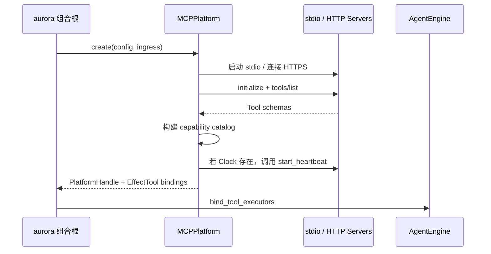
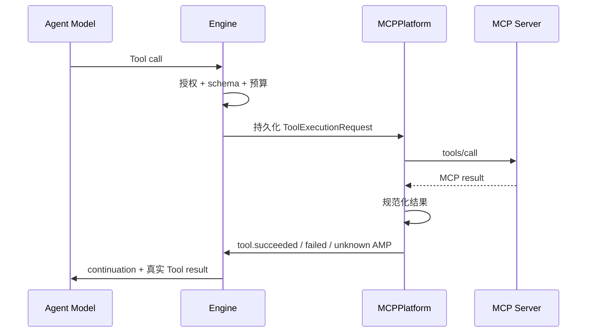

# MCP Platform

Platform 把外部生态归一化为 AMP，并执行已获权的环境效果。nightly 的平台注册表只有 MCP；Console 与 Panel 不属于 Platform。

## 支持范围

| 能力 | Nightly |
| --- | --- |
| 本地 MCP | stdio 子进程 |
| 远程 MCP | HTTPS Streamable HTTP |
| Server 能力 | 动态 `tools/list` 与 `tools/call` |
| 环境事件 | MCP notification → AMP |
| Resources / Prompts | 未接入运行时目录 |
| 断线自动重连 | 文档正在编写；当前连接丢失会停止组合根 |

## 启动流程



任一 App 初始化失败会使 MCP Platform 启动失败，组合根随后回收已经建立的连接和子进程。

## App 配置

### stdio

```toml
[[app]]
package = "org.aurora.clock"
enabled = true
transport = "stdio"
working_dir = "src/apps/aurora-app-clock"
command = ["uv", "run", "--no-sync", "python", "mcp_server.py"]
env = []
timeout_seconds = 30
```

子进程只继承启动所需的有限基础环境、受控临时目录、`AURORA_APP_DATA_DIR` 和 `env` 显式列出的变量。stdout 必须只承载 MCP JSON-RPC；诊断写 stderr。

### Streamable HTTP

```toml
[[app]]
package = "com.example.remote"
enabled = true
transport = "streamable_http"
url = "https://mcp.example.com/mcp"
auth_env = "REMOTE_MCP_TOKEN"
env = []
timeout_seconds = 30
```

远程 URL 必须是 HTTPS。可选 `auth_env` 以 Bearer token 注入认证。HTTP 连接不能声明本地命令或工作目录。

## 工具目录

MCP raw tool name 与配置 package 组合为稳定能力 ID：

```text
raw tool:      set_timer
app package:   org.aurora.clock
capability:    aur.mcp.org.aurora.clock.set_timer
```

发现要求：

- Tool name 非空；
- `inputSchema` 是 JSON 对象；
- 组合后的 capability ID 全局唯一；
- description 与 schema 原样进入能力目录；
- Agent profile 再按精确 ID、前缀通配和排除规则过滤。

App 不需要在 AuroraBot 里另写 tool allowlist 或适配器类。

## 工具执行



成功结果只保留一种规范表示：

1. MCP `structuredContent`；
2. 可解析为 JSON 的文本；
3. 纯文本。

明确的 Server 错误成为 `tool.failed`。连接中断等无法确认真实效果是否发生的异常成为 `tool.unknown`，避免错误地重试不可撤回操作。

## 通知与 AMP

### Aurora 事件通知

App 通过 MCP logging notification 发送：

```json
{
  "logger": "aurora/event",
  "data": {
    "type": "weather.changed",
    "session_id": "weather:shanghai",
    "summary": "上海开始下雨",
    "data": {"level": "moderate"},
    "idempotency_key": "provider-event-123"
  }
}
```

Platform 使用 package、事件类型、session 与幂等键确定性生成 AMP `message_id`。

### 通用通知

其他合法 MCP notification 会包装为：

```json
{
  "type": "mcp.notification",
  "session_id": "com.example.app",
  "summary": "notifications/resources/updated",
  "data": {
    "method": "notifications/resources/updated",
    "params": {}
  }
}
```

保留的 `tool.*` 类型会被拒绝，防止 App 伪造工具回执。stdio 通知队列上限是 256；消费者处理前不会无界增长。

## Clock App

内建 Clock 提供：

- 当前时间；
- 闹钟和定时器；
- 闹钟列表与取消；
- 持久化 heartbeat；
- 由 Agent 调整下一次 heartbeat 的 sleep。

数据位于 `data/platform/mcp/apps/org.aurora.clock/tasks.json`。Platform 发现其 `start_heartbeat` 后自动调用，心跳触发 `system.tick` AMP。

## 生命周期

组合根拥有 PlatformHandle：

- `effect_tools`：EffectTool 绑定目录；
- `event_sources`：EventSource 连接监视与通知归一化；
- `cleanup`：有界关闭回调；
- `server`：若平台自身提供长驻服务。

能力发现完成后，MCP 为每个能力提交 `capability.registered` 保留事件；该事件只写因果事件，不进入 Inbox 或 Triage。

stdio 子进程逆序关闭；HTTP session、后台通知任务与本地 client 统一回收。任一已建立连接意外结束会传播错误并请求整个 AuroraBot 进程停止。

## 当前缺口

::: warning 文档正在编写中
以下边界尚未完全闭环：

- App 工作目录、命令、URL 和必需环境变量的统一启动前诊断；
- MCP 断线自动重连与跨重连 Tool 幂等；
- 核心 TOML 级供应商瞬时事件过滤；
- Resources、Prompts、健康检查、版本兼容与第三方脚手架；
- 真实 stdio/HTTP 长期集成和故障注入覆盖。

当前 App 应在自身边界过滤无持续语义的供应商瞬时事件，并用稳定幂等键上报其余事实。
:::
