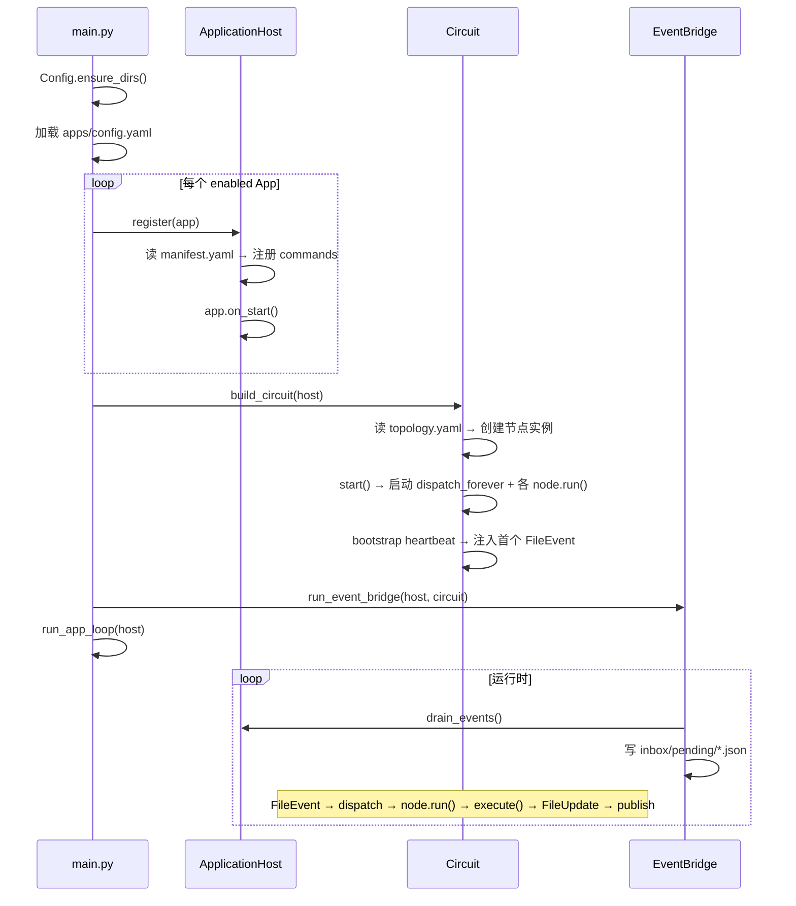
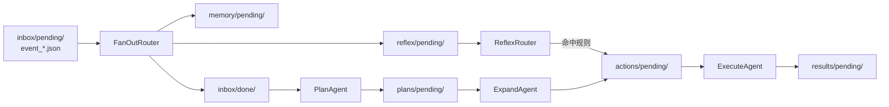

# 架构总览

AuroraBot 总体运行基于 NoneBot2 框架。项目的独特点在于 `src/brain/`: 一个文件驱动、事件驱动的认知引擎。

## 代码结构

| 路径                | 职责                                                                 |
| ------------------- | -------------------------------------------------------------------- |
| `apps/`             | 应用（QQ、Alarm、Diary 等），每个 App 通过 `manifest.yaml` 声明能力  |
| `src/platform/`     | 应用宿主：发现、注册、生命周期、事件队列、命令调度                   |
| `src/brain/kernel/` | 认知电路基础设施：`Node` 基类、`Circuit` 编排器、`FileEventBus` 总线 |
| `src/brain/nodes/`  | 认知节点：`Agent`（LLM 驱动）和 `Router`（纯逻辑）                   |
| `src/brain/memory/` | 三级记忆系统                                                         |
| `src/brain/ai/`     | LLM 网关（litellm）、Embedding 网关                                  |
| `src/main.py`       | 入口：启动两条并行协程线                                             |

## 运行时模型

启动后，`main.py` 创建两条并行的 `asyncio.Task`：

**协程线 A — App 循环** (`run_app_loop`)

```
while 未停止:
    host.tick()          # 遍历所有 App，调用 on_tick()
    sleep(interval)
```

::: tip
App 在 `on_tick()` 中感知外部变化（如 QQ 消息），通过 `PlatformAPI.emit_event()` 将 `AppEvent` 推入 `ApplicationHost` 的事件队列。
:::

**协程线 B — 事件桥 + 认知电路** (`run_event_bridge` + `Circuit`)

```
while 未停止:
    events = host.drain_events()
    for event in events:
        写入 data/kernel/inbox/pending/event_<type>_<id>.json
    sleep(interval)
```

::: tip
文件落盘自动触发 `FileEvent`，经 `FileEventBus.dispatch_forever()` 分发到匹配的节点。节点的 `execute()` 产出新文件，再次触发下游节点，形成循环。
:::

## 启动流程



## 认知电路拓扑

认知节点的邻接关系在 `src/brain/nodes/topology.yaml` 中声明。当前启用的拓扑为：



::: warning
当前内核为 **kernel-α** 内核, 认知电路拓扑结构不够完善, 会逐步集成更多认知节点。
:::

## 下一步阅读

- 想了解 Platform 与 App 的契约：[平台运行时](./platform-runtime.html)
- 想了解 Circuit 与 EventBridge 的协作：[内核运行时](./kernel-runtime.html)
- 想了解认知引擎的详细机制：[认知引擎架构](./brain-architecture.html)
