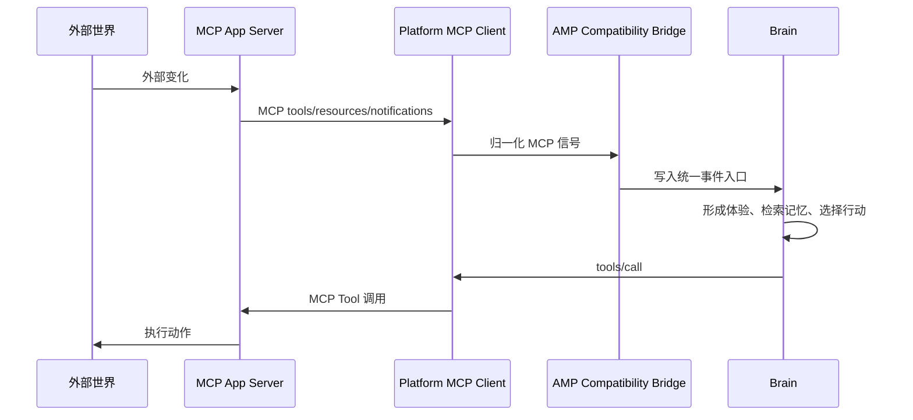

# 架构总览

AuroraBot 的目标架构分为三层：MCP App、Platform、Brain。

这三层的边界必须清楚：

- App 接外部世界。
- Platform 管协议和安全边界。
- Brain 维护生命体的认知连续性。

## 代码结构

```text
AuroraBot/
├── apps/                      # 可选：本地样例或内置 App；不是 MCP Server 固定位置
├── src/
│   ├── main.py                # NoneBot 启动钩子
│   ├── platform/
│   │   └── mcp_kit/           # MCP Server 生命周期、Client 连接、AMP 兼容桥
│   └── brain/
│       ├── runtime.py         # Brain 运行时
│       ├── kernel/            # 文件事件、调度、状态存储
│       ├── nodes/             # 当前旧节点体系，等待重设计
│       ├── memory/            # 记忆存储与检索
│       ├── ai/                # LiteLLM 模型网关
│       ├── prompts/           # 人格与认知提示词
│       └── localhost/         # 本地控制台
└── data/
    ├── kernel/                # Brain 运行痕迹
    ├── memory/                # 记忆数据
    └── app_data/              # App 私有数据
```

## 运行时路径


```mermaid
sequenceDiagram
    participant World as 外部世界
    participant App as MCP App Server
    participant Platform as Platform MCP Client
    participant Bridge as AMP Compatibility Bridge
    participant Brain as Brain

    World->>App: 外部变化
    App->>Platform: MCP tools/resources/notifications
    Platform->>Bridge: 归一化 MCP 信号
    Bridge->>Brain: 写入统一事件入口
    Brain->>Brain: 形成体验、检索记忆、选择行动
    Brain->>Platform: tools/call
    Platform->>App: MCP Tool 调用
    App->>World: 执行动作
```

## App 层

App 是外部能力的 MCP Server。它可以在主仓库内，也可以在独立仓库、本机任意目录或远程服务中；Platform 通过 MCP 连接信息和外围元信息发现并使用它。

| MCP 能力 | AuroraBot 用法 |
| --- | --- |
| Tools | 发送消息、查询天气、写日记、设置闹钟等有副作用或计算动作 |
| Resources | App 私有只读状态，如日记索引、闹钟列表、能力说明 |
| Prompts | App 自己的辅助模板；不得覆盖 Brain 核心人格与认知提示词 |
| Notifications | 标准 MCP 通知；Platform 负责映射为 AMP，`aurora/event` 只是可选原生扩展 |

App 不保留旧 `PlatformAPI` 依赖，也不通过 `ApplicationHost` 注册命令。

## Platform 层

Platform 是边界层，不是决策层。

它负责：

- 读取 `apps/config.yml`、本地 manifest、registry 或其他外围元信息。
- 启停本地或远程 MCP Server。
- 为每个 Server 建立独立 MCP Client session。
- 聚合 `tools/list`，检测工具名冲突。
- 执行 `tools/call`。
- 接收 MCP lifecycle、tools、resources、prompts、notifications 等信号，并把归一化后的 AMP 事件交给 Brain。
- 执行超时、权限、日志和崩溃隔离策略。

它不负责：

- 替用户或 Brain 决定该不该调用工具。
- 把 App 私有数据直接塞进 Brain。
- 维护人格、情绪、长期记忆。

## Brain 层

Brain 当前处于重设计阶段。稳定边界只有三条：

1. 所有外部变化都先转成统一事件。
2. 所有行动都从 Brain 的主体状态中产生，再通过 MCP Tool 执行。
3. Brain 内部可以继续使用文件作为可追溯状态载体，但具体节点拓扑不稳定。

详情见 [Brain 架构重设计](./brain-redesign.html)。

## 下一步阅读

- 平台细节：[平台运行时](./platform-runtime.html)
- App 写法：[App 开发指南](../develop/app-development.html)
- MCP 背景：[MCP 模型上下文协议](../appendix/mcp-model-context-protocol.html)
