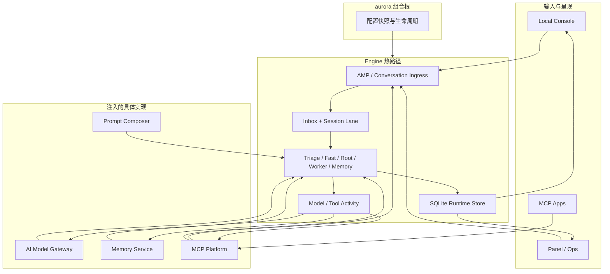
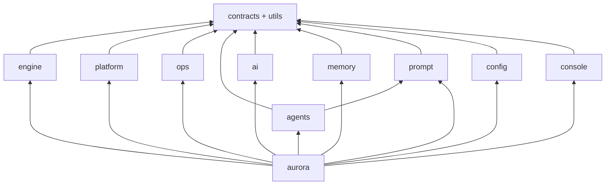

# 系统总览

AuroraBot 的现行实现围绕一条 Agent 热路径和一条检查路径展开。SQLite 是运行态、终态和恢复的权威；没有文件 Inbox、JSON 归档或 JSONL 会话日志。

## 全景


```mermaid
flowchart TB
    subgraph Frontends["输入与呈现"]
        Console["Local Console"]
        Panel["Panel / Ops"]
        Apps["MCP Apps"]
    end

    subgraph Root["aurora 组合根"]
        Compose["配置快照与生命周期"]
    end

    subgraph Hot["Engine 热路径"]
        Ingress["AMP / Conversation Ingress"]
        Inbox["Inbox + Session Lane"]
        Agent["Triage / Fast / Root / Worker / Memory"]
        Activity["Model / Tool Activity"]
        Store["SQLite Runtime Store"]
    end

    subgraph Implementations["注入的具体实现"]
        AI["AI Model Gateway"]
        Memory["Memory Service"]
        MCP["MCP Platform"]
        Prompts["Prompt Composer"]
    end

    Console --> Ingress
    Panel --> Ingress
    Apps --> MCP --> Ingress
    Compose --> Hot
    Ingress --> Inbox --> Agent --> Activity
    Activity --> AI
    Activity --> Memory
    Activity --> MCP
    AI --> Agent
    Memory --> Agent
    MCP --> Agent
    Agent --> Store
    Store --> Console
    Store --> Panel
    Prompts --> Agent
```

## 包职责

| 包 | 职责 |
| --- | --- |
| `src/contracts` | 跨层不可变 DTO、枚举与 Port Protocol |
| `src/utils` | 无业务状态的通用工具 |
| `src/config` | 严格 TOML 加载、校验与不可变快照 |
| `src/prompt` | Prompt 目录、分层 DTO 与上下文装配 |
| `src/engine` | 事件、Task/Agent、邮箱、Activity、调度、因果与运行态存储 |
| `src/agents` | 纯 handler 与模型可见的主动能力 |
| `src/ai` | Provider、模型角色、能力缓存、调用与费用统计 |
| `src/memory` | 窗口、概要、跨域动态、长期事实与主动记忆 |
| `src/platform` | 外部生态输入与效果适配；当前仅 MCP |
| `src/console` | 本地输入和只读输出渲染 |
| `ops` | 热路径外操作、查询、认证、附件、Panel 与调试 sidecar |
| `aurora` | 唯一进程组合根和生命周期所有者 |

`src/sandbox` 保持孤立，当前 Agent 运行时不启用。

## 依赖方向


```mermaid
flowchart BT
    Base["contracts + utils"]
    Engine["engine"]
    Platform["platform"]
    Ops["ops"]
    Agents["agents"]
    AI["ai"]
    Memory["memory"]
    Prompt["prompt"]
    Config["config"]
    Console["console"]
    Aurora["aurora"]

    Engine --> Base
    Platform --> Base
    Ops --> Base
    Agents --> Base
    Agents --> Prompt
    AI --> Base
    Memory --> Base
    Prompt --> Base
    Config --> Base
    Console --> Base
    Aurora --> Engine
    Aurora --> Platform
    Aurora --> Ops
    Aurora --> Agents
    Aurora --> AI
    Aurora --> Memory
    Aurora --> Prompt
    Aurora --> Config
    Aurora --> Console
```

硬边界：

- Engine 不导入 AI、Memory、Agents、Prompt、Config、Platform、Console、Ops 或 Aurora；
- Platform 不导入 Engine 或 Ops；
- Ops 不被热路径实现依赖；
- Agent handler 不直接写运行态或执行外部效果；
- 跨层 DTO 和 Protocol 只定义在 contracts；
- 一个进程只有一个 Engine owner；
- `src` 不反向导入 `aurora`。

这些边界由 `tests/test_dependency_boundaries.py` 保护。

## 组合根

`aurora.runtime` 的启动顺序：

1. 读取所有 TOML 与 Prompt，生成不可变配置；
2. 创建 Prompt catalog、Agent handler、ModelGateway 和 MemoryService；
3. 创建 AgentEngine，并通过 Port 注入模型与记忆；
4. 创建已选择 Platform，发现工具并绑定 ToolExecutor；
5. 创建 Panel 后端和可选 Console；
6. 启动 Engine pump、后台任务和共享停止信号；
7. 发生停止或后台错误时按有界顺序关闭所有资源。

启动部分失败时，`AsyncExitStack` 会回收已经创建的资源。后台任务意外结束会传播到进程所有者，而不是静默消失。

## 热路径与检查路径

### 热路径

```text
输入 → AMP 持久化 → Inbox → Triage → Agent turn
    → Model/Tool Activity → 回执 → 决策提交 → 输出/终态 → 记忆投影
```

Engine 只认识 contracts Port，不知道具体 Provider、MCP client 或 mem0 实现。

### 检查路径

```text
Console 命令 / Panel REST
    → OperationSpec
    → 窄查询或输入 Port
    → OperationResult
```

Ops 不参与 pump。Console 与 Panel 都读取 Engine 的因果与输出投影，不建立第二套对话权威。

## 数据权威

| 数据 | 权威位置 |
| --- | --- |
| Task、Agent、消息、Activity、Inbox、因果、输出提交流 | `data/engine/runtime.sqlite3` |
| 模型费用 | `data/ai/cost.sqlite3` |
| 窗口、概要、durable facts | `data/memory/memory.sqlite3` |
| mem0 历史与 Chroma | `data/memory/` |
| Panel session 与附件索引 | `data/ops/panel.sqlite3` |
| Panel bootstrap token 与附件 | `data/ops/Token.txt`、`uploads/` |
| MCP App 私有数据 | `data/platform/mcp/apps/` |

详细迁移与安全边界见 [Ops 与持久化](./operations-storage.md)。

## 设计权威

冲突时采用以下优先级：

1. [RFC 0300](https://github.com/AuroraBot-Dev/AuroraBot/blob/nightly/docs/rfc/0300-unified-architecture-and-contracts.md)；
2. nightly 当前公共 contracts 与测试；
3. 主仓库 `ARCHITECTURE.md`、`TECHNICAL.md`、README、配置样例和代码注释。

旧 Kernel、Brain、Node 与多份并行 RFC 不再是现行架构的一部分。
