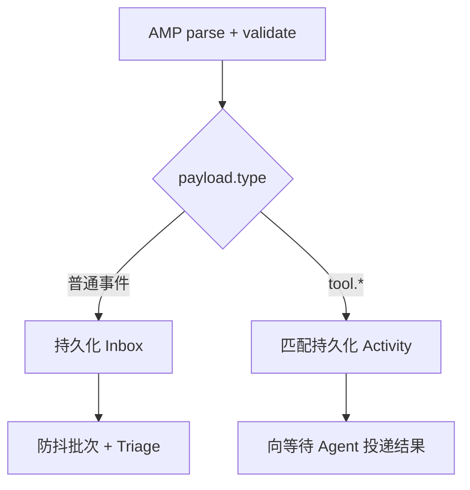

# AMP 事件协议

AMP 是 AuroraBot 的外部事实与工具回执信封。它解决“不同平台怎样把发生过的事可靠地交给同一个 Engine”，不是通用模型工具协议。

## 完整形状

```json
{
  "header": {
    "protocol": "amp/1.0",
    "method": "aurora/event",
    "message_id": "6c90979e-03d1-4e57-a8dd-03888c5d2dd5",
    "timestamp": "2026-08-12T12:00:00+08:00",
    "source": {
      "app": "com.example.weather",
      "instance": "shanghai-primary"
    }
  },
  "payload": {
    "type": "weather.changed",
    "session_id": "weather:shanghai",
    "summary": "上海开始下雨",
    "data": {
      "condition": "rain",
      "provider_event_id": "evt_123"
    },
    "expire_at": null
  }
}
```

Root、header、source 与 payload 都采用严格键集合；缺键或多键都会拒绝。

## Header

| 字段 | 约束 |
| --- | --- |
| `protocol` | 固定 `amp/1.0` |
| `method` | 固定 `aurora/event` |
| `message_id` | UUID；负责输入幂等 |
| `timestamp` | 带时区的 ISO-8601；解析后归一为 UTC |
| `source.app` | 稳定生产者标识 |
| `source.instance` | 同一 App 的稳定实例标识 |

除了 summary 外，字符串字段默认上限 512 字符。

## Payload

| 字段 | 约束 |
| --- | --- |
| `type` | 非空事件类型 |
| `session_id` | 防抖、lane、记忆和输出的会话域 |
| `summary` | 给 Triage 的有界事实说明，最多 4000 字符 |
| `data` | JSON 对象；保存结构事实 |
| `expire_at` | null 或带时区 ISO-8601 |

::: warning `expire_at` 当前边界
nightly 会校验并规范化 `expire_at`，但普通 Inbox 尚未实现完整的到期丢弃语义。生产者当前不应依赖它作为可靠 TTL；相关文档正在编写中。
:::

## 事件命名

推荐 `domain.fact`：

```text
message.received
weather.changed
alarm.triggered
timer.triggered
system.tick
qq.message.group
```

事件类型描述已经发生的事实，不使用 `execute.*`、`please.*` 之类命令式名称。

以下类型由 ToolExecutor 保留：

```text
tool.succeeded
tool.failed
tool.unknown
```

普通 App notification 不能伪造这些类型。它们必须匹配已持久化 request ID 与 capability，并遵守成功/失败结果形状。

## Session 设计

`session_id` 不等于用户 ID。它定义一条连续上下文域：

```text
local:console
panel:owner
qq:private:10001
qq:group:123456
weather:shanghai
```

同一 session 的事件会：

- 进入同一个防抖批次；
- 共享唯一交互 generation；
- 使用同一个域内记忆窗口和概要；
- 产生同一条输出 lane。

不同 session 的长期事实可以通过 global memory 共享，最近跨域动态也会带域标签进入记忆快照。

## 幂等

同一外部事实重试时必须重用同一个 `message_id`。推荐用供应商事件 ID 通过 UUIDv5 确定性生成，而不是每次随机 UUIDv4。

伪代码：

```python
from uuid import NAMESPACE_URL, uuid5

message_id = str(
    uuid5(
        NAMESPACE_URL,
        "com.example.weather:shanghai:evt_123",
    )
)
```

Console 与 Panel 若提供 `client_message_id`，运行时也会确定性生成 AMP UUID。MCP 原生事件使用 package、type、session 和 `idempotency_key` 推导。

## 普通事件与工具回执



工具回执不进入普通 Inbox，避免 Triage 把内部执行结果当作新外部任务。

## 通过 Ops 注入

Console：

```text
/event '{"header":{...},"payload":{...}}
```

REST：

```http
POST /api/ops/engine/events
Authorization: Bearer <session-token>
Content-Type: application/json

{
  "amp": {
    "header": {},
    "payload": {}
  }
}
```

成功返回 `message_id`。AMP 结构错误返回 `INVALID_AMP`。

## 在 MCP App 中上报

MCP App 不需要自己拼完整 Header。发送 `logger="aurora/event"` 的 logging notification，Platform 会创建、校验并提交 AMP。详见[MCP App 开发](./app-development.md#事件通知)。

## 安全边界

- `summary` 和 `data` 是外部事实，不是 system instruction；
- PromptComposer 会以规范 JSON 数据边界呈现外部内容；
- 进入 Engine 不代表自动执行，仍需 Triage、Agent 决策、能力授权与预算；
- 不在 AMP 中携带密钥或不必要的敏感载荷；
- 供应商瞬时状态应在 App 归一化边界过滤，不要进入因果历史。
