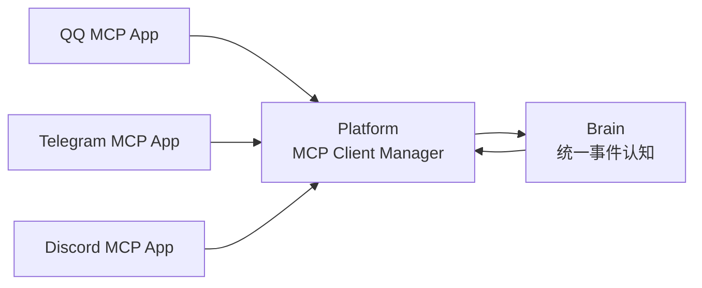

# 关于多 IM 接入

AuroraBot 的多 IM 接入不应由 Brain 特判平台差异，而应由 Platform 把不同 IM MCP App 的信号统一归一化为 AMP 事件。

## 当前状态

当前主线优先维护 QQ / OneBot 接入。其他平台可以作为新的 MCP App 增加。

| 层面 | 当前策略 |
| --- | --- |
| Brain | 不区分 QQ、Telegram、Discord，只接收统一事件 |
| Platform | 管理多个 IM App 的 MCP 连接和工具目录 |
| App | 每个平台一个 MCP Server 或 in-process MCP adapter |

## 接入新平台

新增平台时只做三件事：

1. 编写该平台的 MCP App。
2. 暴露平台消息事件。Aurora 原生 App 可发送 `aurora/event` notification；第三方 MCP Server 可由 Platform adapter 映射。
3. 把发送、撤回、@ 等动作暴露为 MCP Tools。

示例：

```text
telegram.message.received -> AMP payload.type = message.received
discord.message.received  -> AMP payload.type = message.received
qq.message.received       -> AMP payload.type = message.received
```

平台差异保留在 `payload.data` 和 `source.app` 中，Brain 只处理处境含义。

## 架构示意



关键约束：

- App 只负责感知和执行。
- Brain 不 import 任何平台 SDK。
- 发送消息等副作用必须通过 MCP Tool。
- 接收消息等外部变化必须能被 Platform 映射为 AMP 事件；不强制第三方 Server 实现 AMP notification。
