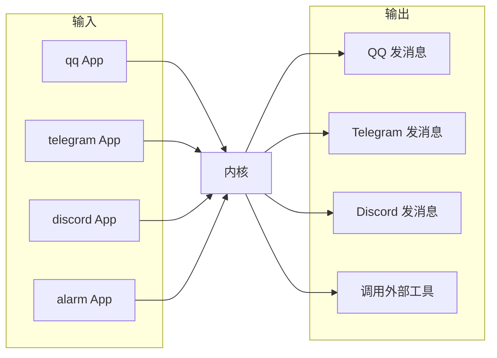

# 常见问题

## AuroraBot 支持哪些社交平台?

::: tip
对 AuroraBot 而言, 跨平台接入的关键不是框架能力 (框架已有), 而是**为每个平台编写对应的 App**。
:::

AuroraBot 允许让任意 MCP 服务器以 App 形态接入:

- 任何遵循 MCP 协议的工具都可以成为 AuroraBot 的能力延伸
- MCP 工具会被自动映射为内核可调用的命令
- 内核无需感知 MCP 协议细节, 由适配容器统一处理

这意味着 **跨平台的概念将从"跨聊天平台"扩展到"跨工具生态"** -- 你的 AuroraBot 不仅能同时在 QQ、Telegram、Discord 上聊天, 还能调用任何 MCP 兼容的外部工具。

最终图景是一个 **一份认知, 多端感知** 的 Bot :

- 同一个大脑 (认知层) 处理来自不同平台的输入
- 统一联合记忆在所有平台间共享, 跨平台上下文无缝衔接
- App 只负责"感知"和"执行", 不参与决策 -- 决策由内核 + 认知统一做出
- 用户可以随时添加新的 App 来接入新平台, 无需修改内核

---

## 其他

::: info
文档编写中
:::
