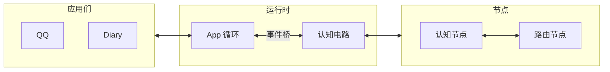

# 项目总览

AuroraBot 是一个基于 NoneBot2 的智能体框架。项目将系统划分为三个职责区域：

- **应用** (`apps`) 负责感知外部输入、暴露可调用的命令
- **平台** (`platform`) 负责管理 App 的注册、生命周期、事件与命令
- **认知** (`brain`) 负责组织包括事件桥、节点、记忆系统等有关认知的组件

::: tip
**CortexForge** 为认知引擎的内部代号。当前内核为 **Kernel-γ**：

- **Pool A (自我之流)**: 第一人称 Markdown 叙事 (`self/stream/now.md`)，维护完整的自我认知流。
- **Pool B (神经JSON系统)**: 无状态 JSON 文件流转——收束、内化、外化、派发。
- **两转义者**: Internalizer (B→A) 将结构化事件转为第一人称体验；Externalizer (A→B) 将自我决定转为结构化动作。

:::

**挼挼如是说**

> 在 AuroraBot 之前, 挼挼其实已经写完了一个叫 Bot-Polaris 的项目. 由于其过于逆天的耦合程度, 导致其虽然效果不错, 但是维护成本极高. 最终挼挼决定投身 AuroraBot 的开发, 致力于构建一个兼容现有生态, 又能做出差异化创新的智能体框架。

## 运行时



启动后通过 `RuntimeState` 管理两条协程线：

- **App 循环** — 定时 `host.tick()`，遍历所有 App 的 `on_tick()`
- **事件桥 + 认知电路** — 轮询 `host.drain_events()`，将 `AppEvent` 转为 JSON 写入 `data/kernel/`，文件落盘自动触发节点执行

`Circuit` 启动时内部创建 `dispatch_forever` 协程 + 每个节点的 `run()` 协程。节点按 `topology.yaml` 配置自动连边，通过文件模式隐式确定上下游。

## 认知管线 (Kernel-γ)

拓扑配置中 `enabled: true` 的节点构成当前管线：

```
外部事件 → MessagePreprocessor（收束+防抖）→ Internalizer（B→A 内化）
         → Externalizer（A→B 外化）→ CommandDispatcher（命令派发）
```

同时运行的节律环路：

```
HeartbeatGenerator（60s 心跳）→ TimerScheduler（cron 匹配）→ 同一条管线
```

- **MessagePreprocessor** — 事件收束 & 消息防抖，所有事件一视同仁格式化
- **Internalizer** — LLM 驱动的 B→A 转义者，将结构化事件转为第一人称体验叙事，追加到自我之流
- **Externalizer** — LLM 驱动的 A→B 转义者，从自我之流中识别行动意图，转译为 JSON 命令
- **CommandDispatcher** — 纯机械派发，解析 JSON 动作并通过 ApplicationHost 执行

旧 Kernel-β 节点 (ImpulseGate / ActionPlanner / PolarisAgent 等) 已在拓扑中禁用，保留代码供参考。

## 适合的场景

- 养赛博妹妹
- 养赛博女鹅
- 个人助手 (类似 [AstrBot](https://astrbot.app/) , [OpenClaw](https://openclaws.io/zh/))

::: tip
当前版本仅支持 QQ 接入，后续版本将支持更多平台。且个人助手的支持不是第一目标, 可能会长期搁置。
:::

## 已经具备的能力

- 应用发现、注册、生命周期管理（`ApplicationHost` + `PlatformAPI`）
- 文件事件总线 + 节点调度循环（`Circuit` + `FileEventBus`）
- 声明式拓扑配置（`topology.yaml` 邻接表）
- 自我之流 (SelfStream): `now.md` / `state.md` / `memories/` / `archive/` / `diary/`
- 多角色统一模型网关 (ModelGateway): fast / quality / multimodal / embedding
- 节律系统: HeartbeatGenerator + TimerScheduler
- 本地控制台 (localhost): 命令行交互式调试
- 基础应用已实现：QQ 接入、Alarm、Diary、Clock
- 三级记忆系统（L1 工作记忆 / L2 情景记忆 / L3 语义记忆）

## 当前边界

- 仅支持 QQ 接入（通过 NapCat + onebot 适配器）
- 认知节点体系可扩展，但尚无插件化标准和开发工具链
- MemoryConsolidator / MetricsCollector 等节点已实现但未启用
- 部分应用未完整实现

## 下一步

- 想了解代码结构：[架构总览](../architecture/system-overview.html)
- 想跑起来：[快速开始](./getting-started.html)
- 想写 App：[App 开发指南](../develop/app-development.html)
