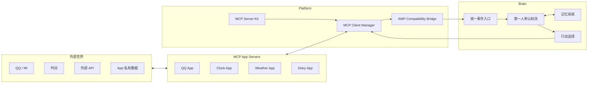

# 项目总览

AuroraBot 是一个面向“持续存在的智能体”的框架。它不把 Bot 视为聊天 API 的薄包装，而是把 Bot 视为一个会接收事件、形成体验、沉淀记忆、选择行动的生命体。

当前文档按重构完成后的目标态编写：App/Platform 层原生兼容 MCP；Brain 层正在重新设计，旧 Kernel-γ 细节不再作为目标架构承诺。

## 三层边界

| 层 | 职责 | 不负责 |
| --- | --- | --- |
| App | 连接外部世界，提供 MCP Tools/Resources/notifications | 推理、人格、跨 App 编排 |
| Platform | 管理 MCP Server、工具目录、事件桥和安全边界 | 业务决策、认知状态 |
| Brain | 把所有事件统一纳入第一人称认知流，决定是否行动 | 直接维护具体平台协议 |

## 核心哲学

AuroraBot 的设计最高哲学是统一事件认知：

- 用户消息、闹钟、天气变化、工具结果、系统节律都是事件。
- 事件不按“用户/环境”分层，而按“它如何影响我”进入认知。
- App 只负责把世界翻译成事件，把行动翻译成外部效果。
- Brain 负责形成体验、保持连续性、选择行动。
- 记忆不是聊天记录缓存，而是生命痕迹的沉淀与再组织。

## 目标运行时

## 当前文档状态

- 平台与 App 文档：按 MCP 重构完成后的目标状态维护。
- Brain 文档：只保留边界和设计草案。旧节点、旧管线、旧双池实现不再作为稳定说明。
- 附录：保留协议背景和历史材料；过时内容会标记为历史资料。

## 下一步

- 想运行项目：读 [快速开始](./getting-started.html)
- 想理解目标架构：读 [架构总览](../architecture/system-overview.html)
- 想写 App：读 [App 开发指南](../develop/app-development.html)
- 想看 Brain 新设计：读 [Brain 架构重设计](../architecture/brain-redesign.html)
