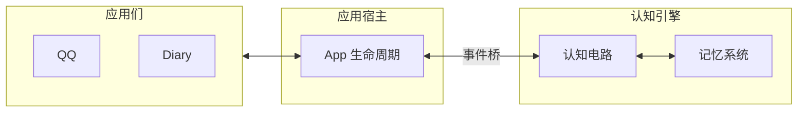

# 项目总览

AuroraBot 是一个基于 NoneBot2 的智能体框架。框架分为三个部分:

- **应用** (`apps`) 负责感知外部输入、暴露可调用的命令
- **平台** (`platform`) 负责管理 App 的注册、生命周期、事件与命令
- **认知** (`brain`) 负责组织包括事件桥、节点、记忆系统等有关认知的组件

**挼挼如是说**

> 在 AuroraBot 之前, 挼挼其实已经写了一个叫 Bot-Polaris 的项目。由于其过于逆天的耦合程度, 导致其虽然效果不错, 但是维护成本极高。最终挼挼决定转向 AuroraBot 的开发, 致力于构建一个兼容现有生态的创新智能体框架。

::: tip
**CortexForge** 为认知引擎的内部代号。当前认知内核为 **Kernel-γ**, 记忆系统为 **Memory-α**。
:::

::: info
后期可能将应用完全 skill 化, 以拓宽生态。
:::

## 运行时

## 认知内核

::: tip Kernel-α
Kernel-α 内核主要用于最小化验证, 使用最基础的超级单Agent模式. 可以通过仅启用 `PolarisAgent` 来启用。
:::

::: tip Kernel-β
Kernel-β 内核节点 (ImpulseGate / ActionPlanner / PolarisAgent 等) 实现了线性多Agent模式, 但是属于单流水线模式。
:::

::: tip Kernel-γ (当前版本)
Kernel-γ 内核逐渐形成认知网图, 实现非线性的认知和记忆。并即将支持社区认知插件。(如 多模态认知节点, 梦境等)
:::

## 适合的场景

- 养赛博妹妹
- 养赛博女鹅
- 个人助手 (类似 [AstrBot](https://astrbot.app/) , [OpenClaw](https://openclaws.io/zh/))

::: tip
当前版本仅支持 QQ 接入，后续版本将支持更多平台。
:::

::: info
个人助手的支持不是第一目标, 可能会长期搁置。

挼挼认为个人助手的重要基础设施是安全操作系统的能力。但是当前版本的安全性不足以支持Agent安全无害且可信任的操作系统。故个人助手的支持将被搁置。
:::

## 下一步

- 想了解代码结构：[架构总览](../architecture/system-overview.html)
- 想跑起来：[快速开始](./getting-started.html)
- 想写 App：[App 开发指南](../develop/app-development.html)
