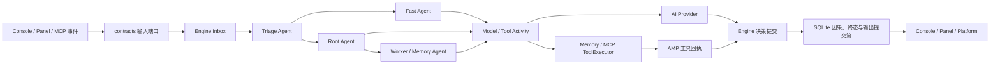

# 认识 AuroraBot

AuroraBot 是一个面向开发者的开源自主智能体框架。她不是“收到一条消息、调用一次模型、返回一段文本”的包装器，而是一个能持续接收环境事实、维护任务状态、委派工作并在授权边界内行动的 Agent 运行环境。

我们习惯称 AuroraBot 为“她”。这表达的是项目方向：为数字生命提供可持续存在的运行结构，而不是暗示系统已经具有人类意识。

## 三个核心概念

### 因果事件

用户消息、MCP App 通知、时间变化、工具回执和子 Agent 报告都会变成事件。事件经过同一个 Engine 入口，并在 `causal_events` 中形成可查询的因果记录。

“事件平权”不等于没有优先级。交互工作会优先调度，直接点名或明确纠正可以触发有界抢占，权限和预算也始终有效。它强调的是输入先作为事实被理解，而不是仅凭来源自动成为最高指令。

### 同构 Agent

Triage、Fast、Root、Worker 和 Memory 都由同一组三元组实例化：

1. `AgentContext`：本轮可见的 Task、消息、记忆、children 和能力；
2. `AgentProfile`：模型角色、能力授权和委派范围；
3. handler：把只读上下文转换为一个原子 `AgentDecision`。

复杂工作可以形成有界监督树，但子 Agent 不会绕过 Engine 直接操作环境。

### 主动节律

启用内建 Clock MCP App 后，持久化心跳会产生 `system.tick` 事件。Engine 以单独的自主 Task 预算处理这些事件，让 Agent 在没有即时对话时也能决定思考、行动或继续等待。

::: info 默认状态
nightly 的 Clock App 默认关闭，所以“主动节律”有实现，但首次启动不会自动启用。启用方法见[配置](./configuration.md#启用-clock-主动节律)。
:::

## 现行运行图

关键边界是：

- Engine 拥有事件、状态、邮箱、Activity、预算、调度与因果热路径；
- Agent handler 只做决策，不直接调用 Provider、数据库或平台客户端；
- 外部效果由获权 ToolExecutor 执行，结果再作为 AMP 回执进入 Engine；
- Console、Ops 和 Panel 位于热路径外，只通过窄端口输入、查询和渲染；
- `aurora` 是唯一组合根，负责创建、连接和关闭所有具体实现。

## Nightly 已实现什么

- 会话级 Inbox 防抖、批次上限、Triage 的 process/defer/discard；
- Fast 快路径与 Root 主路径的获权选择；
- 持久化 Task、Agent、消息、Activity、因果事件和用户输出提交流；
- 会话 revision、watermark、delta、提交屏障与有界抢占；
- 多 Tool call 可恢复链、幂等工具回执和崩溃恢复；
- Fast、Quality、Multimodal、Embedding 模型角色与费用 SQLite；
- 域内窗口/概要、跨域动态、全局 durable facts 和语义/关键词降级记忆；
- stdio 与 HTTPS Streamable HTTP MCP、动态工具发现和通知事件桥接；
- 本地 Console、统一 Ops 操作树、带认证的 Panel 后端和独立 Web 前端。

## 当前不承诺什么

AuroraBot 仍处于 0.5 alpha：

- Panel 只允许 loopback、单 owner，不是公网多租户安全边界；
- 默认配置仍启用了仓库外 Aurora-QQ，干净克隆需要手动关闭或另行安装；
- 附件可以存储和传递引用，但尚未进入完整多模态理解链路；
- Sandbox 与 Speech 没有进入获权运行时；
- 终态 TTL、WAL checkpoint、统一备份/恢复和长期 soak test 尚未闭环；
- MCP 断线当前会让组合根停止，自动重连契约仍在编写；
- 第三方插件市场、自动发现、热加载与稳定兼容范围尚未定义。

完整清单见 [Nightly 实现状态](../reference/nightly-status.md)。

## 下一步

- 想先跑起来：进入[快速开始](./getting-started.md)。
- 想理解核心：阅读[系统总览](../architecture/system-overview.md)。
- 想接入外部能力：阅读[MCP App 开发](../develop/app-development.md)。
- 想参与主仓库：阅读[参与开发](../develop/contributing.md)。
